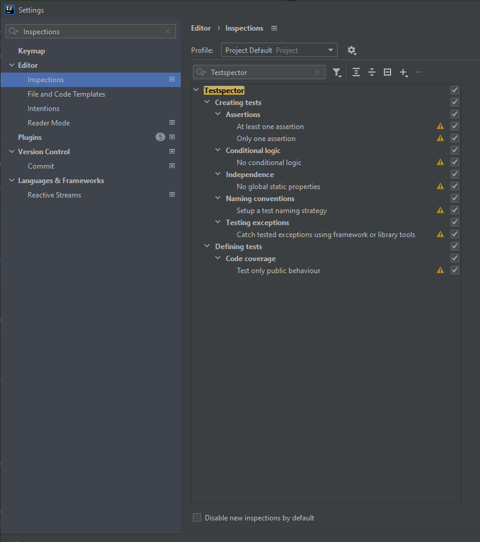
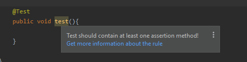
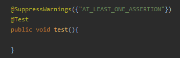
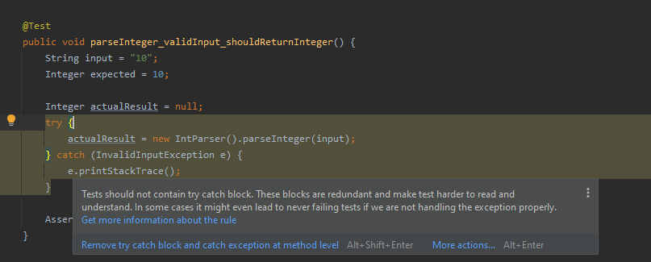
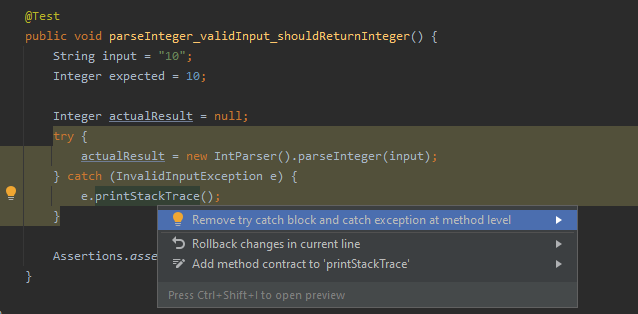
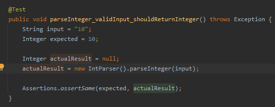
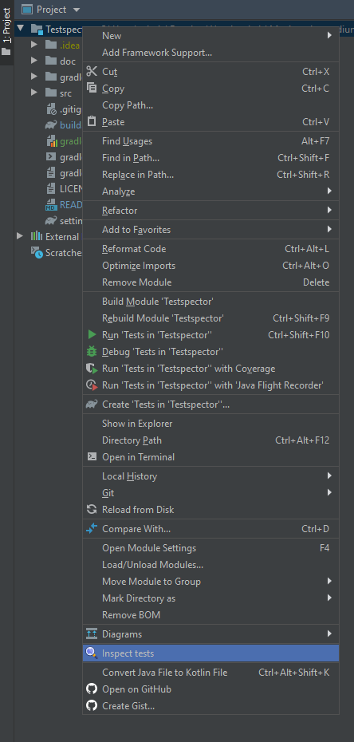
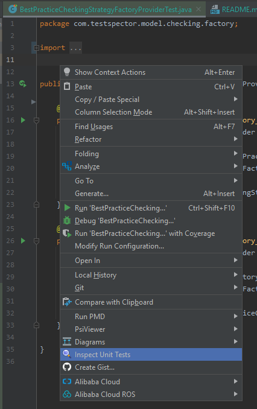
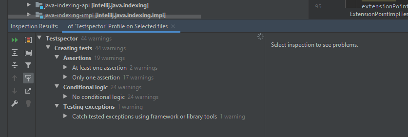

# Testspector   

Testspector is an IntelliJ IDEA plugin that via code inspections helps developers with writing unit tests. It contains a dataset of best practices that should be followed when writing unit tests. 
The unit tests are checked against the dataset and any violation is reported to the user. The user is provided with a description of the problem, hints and also actions for fixing the issue. 
Description also contains links to the documentation where are all best practices described with examples.

Plugin URL: https://plugins.jetbrains.com/plugin/16300-testspector

## Documentation

### Best practices 
The dataset of best practices was created by a detailed analysis of the world’s top books and studies regarding unit testing. 

* 

Current version of the plugin supports checking of the following 7 best practices for [JUnit 5](https://junit.org/junit5) and [JUnit 4](https://junit.org/junit4):

* [Test only public behaviour](./doc/Practices.md#test-only-the-public-behaviour-of-the-tested-system)
* [At least one assertion](./doc/Practices.md#at-least-one-assertion-per-test)
* [Only one assertion](./doc/Practices.md#only-one-assertion-per-test)
* [No global static properties](./doc/Practices.md#do-not-use-global-static-properties)
* [Set up a test naming strategy](./doc/Practices.md#setup-a-test-naming-strategy)
* [Catch tested exceptions using framework tools](./doc/Practices.md#catch-tested-exceptions-using-framework-or-library-tools)
* [No conditional logic](./doc/Practices.md#do-not-use-if-switch-for-or-while-blocks-in-a-test)

### Architecture
The architecture of the plugin was designed in a way that supports implementation for any unit testing framework that is currently supported by the IntelliJ IDEA platform.
* [Architecture](./doc/Architecture.md) 

## Supportability

The plugin currently supports following IntelliJ products:
* IntelliJ IDEA Educational — 2019.3 — 2021.1.3

* IntelliJ IDEA Ultimate — 2019.3 — 2021.1.3

* IntelliJ IDEA Community — 2019.3 — 2021.1.3

* Android Studio — build 193.0 — 212.0

# Install
Install the plugin by going to ``Settings -> Plugins -> Browse repositories`` and then search for **Testspector**.

# Configuration
Inspections are part of the IntelliJ IDEA inspections and can be configured by going to ``Settings -> Editor -> Inspections``.  All inspections are in the group **"Testspector"**
and each inspection is also categorized into a separate group and subgroup based on to which best practice it checks (see ).
Every inspection or group with inspections is configurable - it is possible to decide if it will be enabled or disabled and severity and scope, in which it will run, can be set as well.
By default, all inspections are enabled and the severity level is set to **Warning**.

It is possible to suppress inspections for a certain part of the code. For example for methods or classes. For that purpose annotation ``@SuppressWarnings({"INSPECTION_NAME"})`` can be used. An example for suppressing inspection **AT_LEAST_ONE_ASSERTION** can be seen below.

# Usage

By default inspections are invoked automatically once user opens a file or makes some changes to it. Identified problems are highlighted in the code and if user hovers them description of the problem is provided. Except for descriptions there are sometimes hints how to solve the issue and in some cases use is even provided with action which will automatically fix the issue. 
Description also contains link to the   where is broken best practice described in detail. 
Example can be seen below. There is a test that contains redundant try catch block. 

Catching the exception is not part of the test, it makes test harder to read and makes it longer. It can be removed and exception can be caught at method level. 

 

## Invoke inspection manually

Inspections can be invoked manually two different ways:

*  Using project view popup menu and selecting any file or folder:
   

*   Using editor popup menu in any file
    

Inspection runs in the background and detected problems are over time added to the report.

