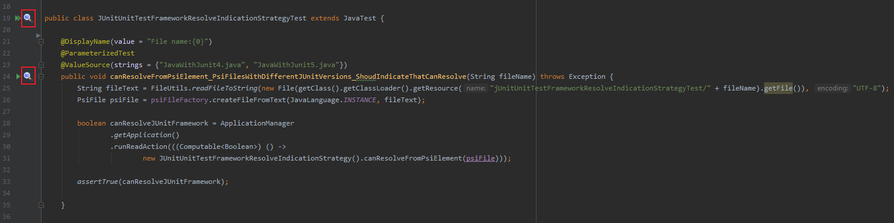
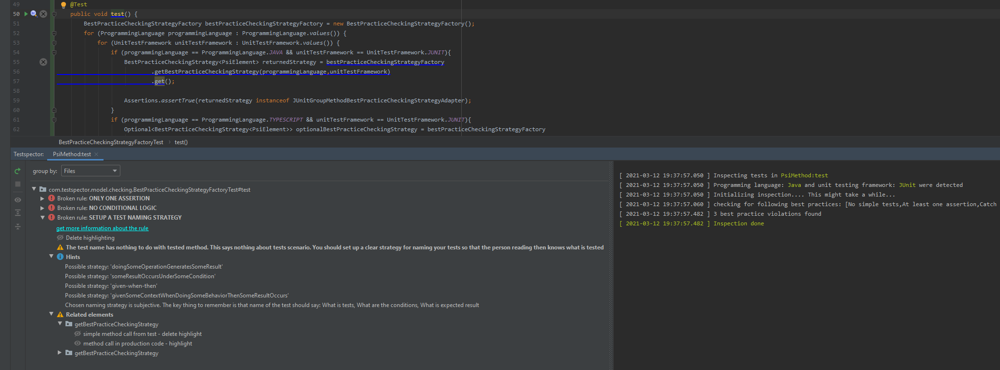

# Testspector   

Testspector is an IndelliJ IDEA plugin which helps developers with writing unit tests. It contains a dataset of best practices which should be followed when writing unit tests. The unit tests are checked against the dataset and any violation is reported to the user. User is provided with description to the problem, hints how to solve it and also parts of code causing the problem. 
Report also contains links to the documentation where are all best practices described with examples.

Plugin URL: https://plugins.jetbrains.com/plugin/16300-testspector

### What do you think of the plugin?
Please let me know by filling this survey: https://www.survio.com/survey/d/R2L3F8O5P2S0F7I2C (**very short 10 min max, just 8 questions where 6 mandatory**).  This would help me a lot, since it will show me if I am headed the right direction and the plugin is useful.

## Documentation

### Best practices 
The dataset of best practices was created by detailed analysis of the world’s top books and studies regarding unit testing. The plugin is result of a master thesis at a czech university. I copied identified best practices straight from my master thesis. Therefore it is currently available only in czech. The documantation contains direct references to chapters in books and studies where the best practices were derived from. 

* [Documentation translated by Google in English](https://ooh3dpsdytm34sfhws63yjfbwy--github-com.translate.goog/Hasatori/Testspector/blob/master/doc/Practices.md) - translation is quite good but totally wrong at times
* 

I am currently working on translation. In the meantime please use the translation from google.

Current version of the plugin supports checking of the following 7 best practices for  and :

* [Test only public behaviour](https://ooh3dpsdytm34sfhws63yjfbwy--github-com.translate.goog/Hasatori/Testspector/blob/master/doc/Practices.md#testovat-pouze-verejne-chovani-testovaneho-systemu)
* [At least one assertion](https://ooh3dpsdytm34sfhws63yjfbwy--github-com.translate.goog/Hasatori/Testspector/blob/master/doc/Practices.md#minimalne-jedna-overovaci-metoda-na-test)
* [Only one assertion](https://ooh3dpsdytm34sfhws63yjfbwy--github-com.translate.goog/Hasatori/Testspector/blob/master/doc/Practices.md#prave-jedna-overovaci-metoda-na-test)
* [No global static properties](https://ooh3dpsdytm34sfhws63yjfbwy--github-com.translate.goog/Hasatori/Testspector/blob/master/doc/Practices.md#nepouzivat-globalni-staticke-promenne)
* [Set up a test naming strategy](https://ooh3dpsdytm34sfhws63yjfbwy--github-com.translate.goog/Hasatori/Testspector/blob/master/doc/Practices.md#urcit-strategii-pojmenovani-testu)
* [Catch tested exceptions using framework tools](https://ooh3dpsdytm34sfhws63yjfbwy--github-com.translate.goog/Hasatori/Testspector/blob/master/doc/Practices.md#odchytavat-testovane-vyjimky-pomoci-nastroju-knihoven-ci-testovacich-frameworku)
* [No conditional logic](https://ooh3dpsdytm34sfhws63yjfbwy--github-com.translate.goog/Hasatori/Testspector/blob/master/doc/Practices.md#podminena-logika)

### Architecture
Architecture of the plugin was designed in a way that it supports implementation for any unit testing framework that is currently supported by IntelliJ IDEA platform. With architecture it is same case as with the best practices documentation. I copied it from my master thesis, only UML diagrams are in 
* [Architecture translated by Google in English](https://ooh3dpsdytm34sfhws63yjfbwy--github-com.translate.goog/Hasatori/Testspector/blob/master/doc/Architecture.md) - translation is quite good but totally wrong at times
*  

I am currently working on translation. In the meantime please use the translation from google.

## Supportability

Plugin currently supports IntelliJ IDEA ultimate versions 2019.2 (192) - 2020.3.3 (211)

# Install
Install the plugin by going to ``Settings -> Plugins -> Browse repositories`` and then search for **Testspector**.

# Usage
1. Invoke inspection:
   * Using side navigation window and selecting any file or folder:

      
   * Based on unit testing framework and programming language inspection can be invoked on a single test or object that contains them. For example for JUnit by clicking on a icon next to the test class or test method declaration

      

2. Report showing violated best practices is generated. In some cases there are hints suggesting how the problem can be solved. If you need more information about the best practice or want to check out other best practices there is also a link to the documentation.

      
