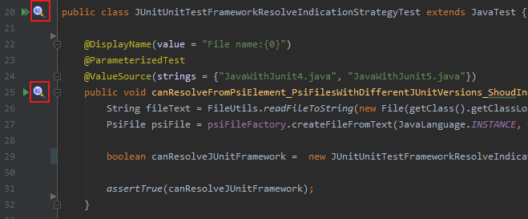

# Testspector  

Testspector is a plugin for checking quality of unit tests. It contains a dataset of 62 best practices which should be followed when writing unit tests. The unit tests are checked against the dataset and any violation is reported to the user. User is provided with description do the problem, hints how to solve it and also parts of code causing the problem. 
Report also contains links to the documentation where are all best practices described with examples (the documentation can be found here:  - My apolologies but the description of best practices is only in czech language for now. The plugin is result of a czech master thesis, and these parts were copied directly from there. Translation is in progress) 

## Supportability

 of the plugin was designed in a way that it supports implementation for any unit testing framework that is currently supported by IntelliJ IDEA platform.

A current version of the plugin supports checking of the following 8 best practices for unit testing framework **JUnit** version **4** and **5**:

* 
* 
* 
* 
* 
* 
* 
* 

# Install
Install the plugin by going to ``Settings -> Plugins -> Browse repositories`` and then search for **Testspector**.

# Usage
1. Invoke inspection:
   * Using side navigation window and selecting any file or folder:

      
   * Based on unit testing framework and programming language inspection can be invoked on a single test or object that contains them. For example for JUnit by clicking on a icon next to the test class or test method declaration

      

2. Report showing broken best practices is generated. In some cases there are hints suggesting how the problem can be solved. In case when you need more information about the best practice there is also a link to the documentation.

      
