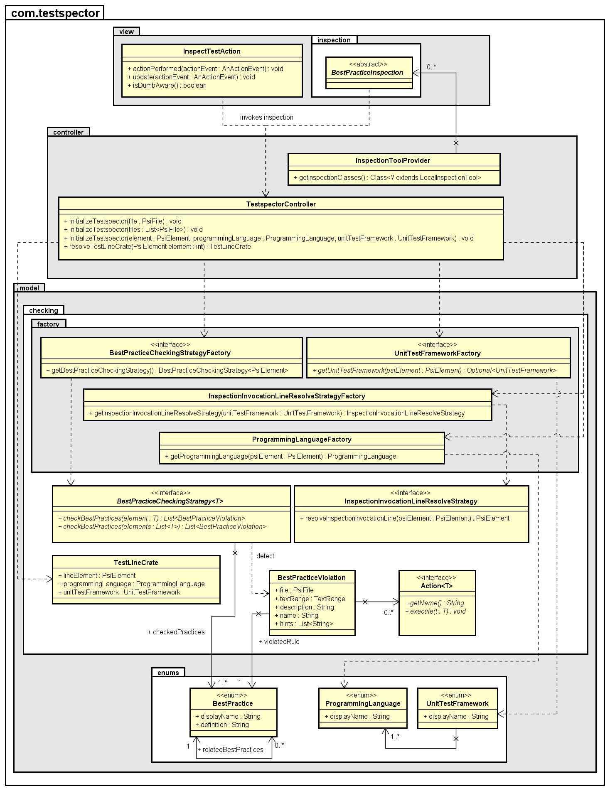
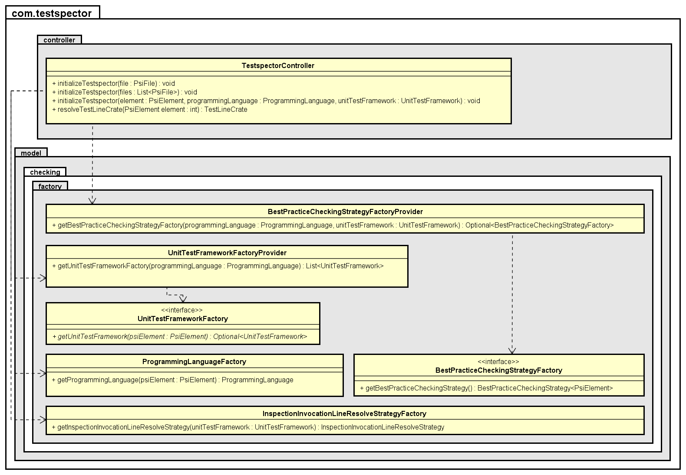
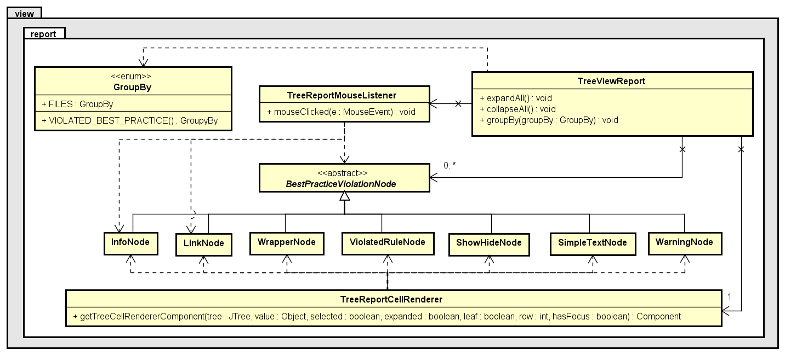
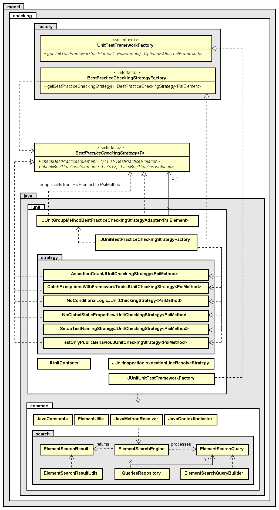

# Popis architektury

## Obecný popis architektury

Z ákladem celého řešení je softwarová architektura MVC: 
 * Třídy zajišťující vykreslování výsledků informací uživateli jsou uloženy v balíčku ``com.testspector.view``
 * Veškerá logika pro kontrolu a tvorbu dat je uložena v balíčku ``com.testspector.model``
 * Obě vrstvy jsou následně řízeny a propojeny pomocí tříd uložených v balíčku ``com.testspector.controller``

Balíček ``com.testspector.view`` třída ``InspectTestAction``, reprezentující akci, kterou uživatel skrze nabídku menu přehledu projektu spouští kontrolu dodržování nejlepších postupů nad vybranou částí systému. Tato třída je potomkem nativní třídy platformy IntelliJ IDEA ``com.intellij.openapi.actionSystem.AnAction``, kterou musejí pluginy dědit, aby mohli v rámci vývojového prostředí spouštět různé předdefinované akce. Další třídou, která se vztahuje k spouštění kontroly, ale tentokrát na konkrétního testu, je třída ``TestLineMakerFactory``. Třída opět dědí z platformy IntelliJ IDEA ``com.intellij.codeInsight.daemon.LineMarkerProvider``  a slouží pro označení řádky kódu. Třída tak reprezentuje továrnu, která vyrobí označení řádku kódu, kde je možné kontrolu spustit. 

Třídy ``InspectTestAction``, ``TestLineMarkerFactory`` jsou tedy průvodními prvky, které s pomocí třídy ``TestspectorController`` spouštějí kontrolu dodržování nejlepších postupů na vybrané části systému. ``TestspectorController`` zjištěná data po dokončení kontroly předává třídě uživatelského rozhraní ``ToolWindowContent``, která představuje záložku v okně nástrojů pluginu a vytváří výsledný report ve stromové struktuře. Vedle tvorby reportu, také umožňuje s reportem pracovat, měnit seskupení dat, či znovu spouštět kontrolu na stejné části systému. Report je reprezentován třídou ``TreeViewReport``.

Zásadní částí celého řešení jsou však třídy modelu. Řídící prvek ``TestspectorController`` s pomocí továren ``ProgrammingLanguageFactory`` a ``UnitTestFrameworkFactory`` zjišťuje informace o tom jaký programovací jazyk element reprezentuje a testy jakého testovacího frameworku obsahuje. Pro továrnu ``UnitTestFrameworkFactory``, byla záměrné nastavena návratová hodnota na ``Optional<UnitTestFramework>``, jelikož pro element, který je předávaný jako parametr nemusí být vždy možné testovací framework vytvořit. Informace následně předává továrně ``BestPracticeCheckingStrategyFactory``a ta vytvoří odpovídající instanci ``BestPracticeCheckingStrategy``, která umí zpracovávat instance ``com.intellij.psi.PsiElement``. To, aby vyráběná instance uměla zpracovat instance ``PsiElement`` bylo zvoleno, jelikož ``PsiElement`` stojí na vrcholku všech psi elementů, které IntelliJ používá a tím pádem tento přístup zajišťuje nejvyšší míru volnosti.  ``BestPracticeCheckingStrategy`` reprezentuje generickou instanci, která provádí kontrolu dodržování nejlepších postupů na elementu určitého typu a poskytuje hlášení o porušených nejlepších postupech. 

Porušení je reprezentováno třídou ``BestPracticeViolation``, která mimo základních informací poskytuje seznam elementů souvisejících s problémem. Vedle těchto tříd je zde dále pomocná továrna ``InspectionInvocationLineResolveFactory``, která pro daný testovací framework poskytuje strategii pro vymezení konkrétního místa v kódu odkud lze kontrolu spustit. Tato informace je velmi důležitá a spolu s přepravkou ``TestLineCrate`` je využívána třídami uživatelského rozhraní pro vykreslení místa spuštění kontroly. Dalšími důležitými prvky, které však nejsou na obr. 23 z důvodu zachování čitelnosti zachyceny jsou třídy ``UnitTestFrameworkFactoryProvider`` a ``BestPracticeCheckingStrategyFactoryProvider``, které na základě informací o programovacím jazyku či testovacím frameworku poskytují odpovídající továrnu. Továrny ``UnitTestFrameworkFactory`` a ``BestPracticeCheckingStrategyFactory`` byly záměrně specifikovány jako abstraktní, tak aby byla zajištěn princip jedné odpovědnosti a kód byl pod správou pouze odpovídajících konkrétních instancí, které byly pro testovací framework implementovány.  

Jak je možné si všimnout, tak základem celého řešení jsou návrhové vzory Továrna a Strategie. Tento přístup umožňuje podporu pro jakýkoliv programovací jazyk a testovací framework podporovaný platformou IntelliJ. Při implementaci konkrétního řešení poté stačí pouze vytvořit konkrétní reprezentace pro abstraktní továrny a strategie a na jejich základě řídící prvek TestspectorController získá data a třídy je vykreslí uživateli.

### Datailní návrh architektury

## Architektura implementace pro testovací framework JUnit

