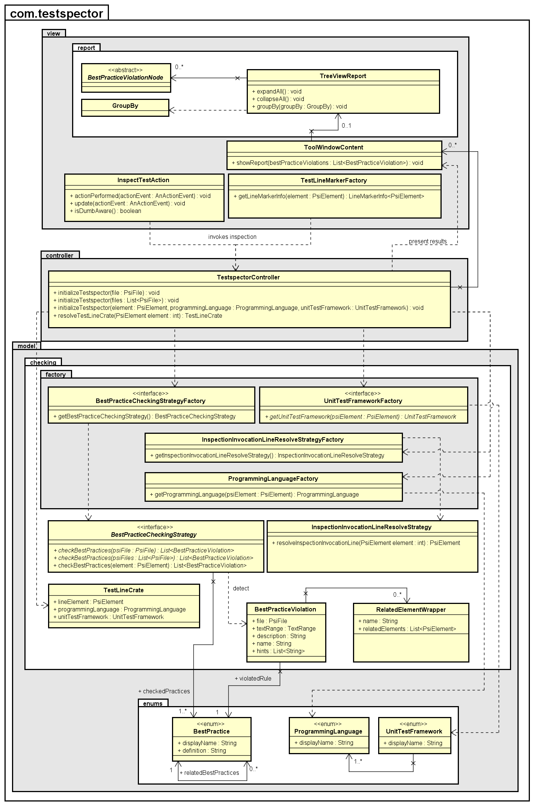

# Architecture
Overall architecture pattern is MVC: 
* View classes used to present data to the user are stored in the package ``com.testspector.view``
* Model classes used to prepared data are stored in the package ``com.testspector.model``
* Both layers then interact with each other via controller classes stored in ``com.testspector.controler``

