# Obsah

[1	Vytváření testů](#vytvareni-testu)

>   [1.1	Práce s duplicitami](#práce-s-duplicitami)

>>[1.1.1	Extrakce opakujících se částí testovacího kódu](#extrakce-opakujících-se-částí-testovacího-kódu)

>> [1.1.2	Extrakce opakujících se testovacích metod](#extrakce-opakujících-se-testovacích-metod)

>   [1.2	Rychlost](#rychlost)

>> [1.2.1	Používání „In memory“ prostředků a mockování](#používání-„in-memory“-prostředků-a-mockování)

>> [1.2.2	Vyhýbat se akcím, které uspávají hlavní vlákno](#vyhýbat-se-akcím,-které-uspávají-hlavní-vlákno)

>   [1.3	Ověřování (kontrola)](#ověřování-(kontrola))

>> [1.3.1	Minimálně jedna ověřovací metoda na test](#minimalne-jedna-overovaci-metoda-na-test)

>> [1.3.2	Právě jedna ověřovací metoda na test](#prave-jedna-overovaci-metoda-na-test)

>> [1.3.3	Nepoužívat strážní ověřovací metody (tzv. Guard Assertion)](#nepoužívat-strážní-ověřovací-metody-(tzv.-guard-assertion))

>> [1.3.4	Dodržovat správné pořadí parametrů ověřovací metody](#dodržovat-správné-pořadí-parametrů-ověřovací-metody)

>> [1.3.5	Přikládat zprávy o popisu chyby](#přikládat-zprávy-o-popisu-chyby)

>   [1.4	Struktura testovací metody](#struktura-testovací-metody)

>> [1.4.1	3-fázový design testů](#3-fázový-design-testů)

>> [1.4.2	4-fázový design testů](#4-fázový-design-testů)

>> [1.4.3	Neopakovat fáze testů](#neopakovat-fáze-testů)

>> [1.4.4	Oddělovat části testu](#oddělovat-části-testu)

>   [1.5	Proměnné](#proměnné)

>> [1.5.1	Nahrazovat pevné hodnoty konstantami](#nahrazovat-pevné-hodnoty-konstantami)

>> [1.5.2	Nepoužívat magická čísla](#nepoužívat-magická-čísla)

>   [1.6	Ostatní doporučení](#ostatní-doporučení)

>> [1.6.1	Zachovávat spolehlivost testů](#zachovávat-spolehlivost-testů)

>> [1.6.2	Odstraňovat mrtvý kód](#odstraňovat-mrtvý-kód)

>> [1.6.3	Oddělovat generování dat od jejich verifikace](#oddělovat-generování-dat-od-jejich-verifikace)

>   [1.7	Testování výjimek](#testování-výjimek)

>> [1.7.1	Odchytávat testované výjimky pomocí nástrojů knihoven či testovacích frameworků](#odchytavat-testovane-vyjimky-pomoci-nastroju-knihoven-ci-testovacich-frameworku)

>> [1.7.2	Stanovovat obecnou úroveň pro výjimky testovací metody](#stanovovat-obecnou-úroveň-pro-výjimky-testovací-metody)

>   [1.8	Podmíněná logika](#podminena-logika)

>> [1.8.1	Nepoužívat bloky if, else, switch, for či while v rámci testu](#nepouzivat-bloky-if,-else,-switch,-for-ci-while-v-ramci-testu)

>   [1.9	Pojmenování](#pojmenování)

>> [1.9.1	Určit strategii pojmenování testů](#urcit-strategii-pojmenovani-testu)

>> [1.9.2	Zachovat konzistentní pojmenování testů](#zachovat-konzistentní-pojmenování-testů)

>> [1.9.3	Zachovávat jeden styl pojmenování pro koncept](#zachovávat-jeden-styl-pojmenování-pro-koncept)

>> [1.9.4	Používat jména pro známá řešení](#používat-jména-pro-známá-řešení)

>> [1.9.5	Používat vhodné pojmenování pro testovací třídy](#používat-vhodné-pojmenování-pro-testovací-třídy)

>> [1.9.6	Používat vyslovitelné a vyhledatelné názvy](#používat-vyslovitelné-a-vyhledatelné-názvy)

>> [1.9.7	Zamezovat dezinformaci](#zamezovat-dezinformaci)

>> [1.9.8	Dělat dostatečné rozdíly mezi jmény](#dělat-dostatečné-rozdíly-mezi-jmény)

>> [1.9.9	Vynechávat nadbytečné součásti názvů](#vynechávat-nadbytečné-součásti-názvů)

>> [1.9.10	Používat jména vyjadřující záměr](#používat-jména-vyjadřující-záměr)

>   [1.10	Uložení testovací souboru a seskupování testů](#uložení-testovací-souboru-a-seskupování-testů)

>> [1.10.1	Ukládat testy mimo produkční kód](#ukládat-testy-mimo-produkční-kód)

>> [1.10.2	Ukládat testy pro jeden testovaný systém na jedno místo](#ukládat-testy-pro-jeden-testovaný-systém-na-jedno-místo)

>   [1.11	Nezávislost](#nezávislost)

>> [1.11.1	Nepoužívat globální statické proměnné](#nepouzivat-globalni-staticke-promenne)

>> [1.11.2	Nepoužívat znalost domény](#nepoužívat-znalost-domény)

>> [1.11.3	Používat relativní cesty](#používat-relativní-cesty)

>> [1.11.4	Nezávislost na platformě](#nezávislost-na-platformě)

>> [1.11.5	Dodržovat nezávislost na produkčním kódu](#dodržovat-nezávislost-na-produkčním-kódu)

>> [1.11.6	Tvořit vlastní data a zdroje](#tvořit-vlastní-data-a-zdroje)

>   [1.12	Izolovanost](#izolovanost)

>> [1.12.1	Používat správného testovacího dvojníka](#používat-správného-testovacího-dvojníka)

>> [1.12.2	Nepoužívat testovací dvojníky na testovaný systém](#nepoužívat-testovací-dvojníky-na-testovaný-systém)

>> [1.12.3	Nepoužívat návrhový vzor Singleton](#nepoužívat-návrhový-vzor-singleton)

[2	Vymezení testů](#vymezení-testů)

>   [2.1	Pokrytí kódu (Code coverage)](#pokrytí-kódu-(code-coverage))

>> [2.1.1	Neimplementovat jednoduché testy](#neimplementovat-jednoduché-testy)

>> [2.1.2	Implementovat jak happy, tak sad testy](#implementovat-jak-happy,-tak-sad-testy)

>> [2.1.3	Implementovat testy pro každý netriviální systém](#implementovat-testy-pro-každý-netriviální-systém)

>> [2.1.4	Netestovat abstraktní systémy](#netestovat-abstraktní-systémy)

>> [2.1.5	Testovat pouze veřejné chování testovaného systému](#testovat-pouze-verejne-chovani-testovaneho-systemu)

>> [2.1.6	Testovat chování, ne metody systému](#testovat-chování,-ne-metody-systému)

>> [2.1.7	Zachovávat princip jedné odpovědnosti testu](#zachovávat-princip-jedné-odpovědnosti-testu)

>   [2.2	Datové pokrytí (Data coverage)](#datové-pokrytí-(data-coverage))

>> [2.2.1	Testovat hraniční podmínky](#testovat-hraniční-podmínky)

>> [2.2.2	Kontrolovat inverzní vztahy](#kontrolovat-inverzní-vztahy)

>> [2.2.3	Provádět křížovou kontrolu s pomocí jiných prostředků](#provádět-křížovou-kontrolu-s-pomocí-jiných-prostředků)

>> [2.2.4	Vynucovat chybné podmínky](#vynucovat-chybné-podmínky)

>> [2.2.5	Používat jednotkové testy pro měření výkonových charakteristik testovaného systému](#používat-jednotkové-testy-pro-měření-výkonových-charakteristik-testovaného-systému)

>> [2.2.6	Vymezovat třídy ekvivalence](#vymezovat-třídy-ekvivalence)

>> [2.2.7	Testovat krajní hodnoty](#testovat-krajní-hodnoty)

>> [2.2.8	Testovat změny stavu](#testovat-změny-stavu)

>> [2.2.9	Testovat pomocí rozhodovacích tabulek](#testovat-pomocí-rozhodovacích-tabulek)

****

<h1 id="vytvareni-testu">Vytváření testů</h1>

Tato podkapitola obsahuje nejlepší postupy zabývající se tvorbou jednotkových
testů. Pomyslně odpovídá na otázku „Jak by měli testy a testovací kód vypadat?“,
tedy jak by měl samotný kód jednotkových testů vypadat, aby splňoval doporučené
nejlepší postupy a dobře se s ním ostatním programátorům pracovalo. Podkapitola
je dále rozpadnuta do několika podsekcí, které vymezují nejlepší postupy
týkající se určitého aspektu tvorby testů. Některé nejlepší postupy nebylo možné
jednoznačně zařadit do nadřazené skupiny, a proto byly vloženy do obecné sekce
*Ostatní doporučení*.

## Práce s duplicitami

V kontextu programování je obecně bráno duplikování kódu jako špatnou praktikou,
jelikož porušuje jedno ze základních pravidel DRY, tedy „*Do not repeat
yourself!*“, což by se dalo volně přeložit jako „Neopakujte se!“. Pravidlo bylo
původně formulováno v knize **The pragmatic programmer** a jeho znění v
originále zní:

„*Every piece of knowledge must have a single, unambiguous, authoritative
representation within a systém*“(Hunt a Thomas 2000)

**Autorský překlad:**

„*Každa informace musí mít v systému jediné, jednoznačné a autoritativní
zastoupení*“

V tomto ohledu nejsou jednotkové testy žádnou výjimkou a stejný princip bychom
měli aplikovat i na ně. Porušování tohoto pravidla se může zdát z krátkodobého
hlediska poměrně výhodné, protože umožňuje velmi rychlou tvorbu jednotlivých
testovacích případů. Pokud implementujeme nový test, lze využít kódu některého z
dalších testů v dané testovací třídě a následně pouze změnit části specifické
pro test nový. Jak uvádí kniha *Effective unit testing* [(Koskela 2013)](#978-1-935182-57-3), tak z
dlouhodobého hlediska má tento přístup negativní vliv jak na udržovatelnost, tak
na srozumitelnost testovacího kódu. Samotný test by měl obsahovat pouze nezbytné
informace, které pomohou čtenáři velmi snadno a rychle pochopit jeho fungování.
Stejně tak pokud bude v budoucnu potřeba provést v testech změny je časově
úspornější provést změnu pouze na jednom místě. Také tím výrazně snižujeme
riziko opomnění provedení změn na všech místech.

Nejlepší postupy týkající se práce s duplicitami jsou následující:

-   Extrakce opakujících se částí testovací kódu

-   Extrakce opakujících se testovacích metod

### Extrakce opakujících se částí testovacího kódu

Části kódu opakující se mezi jednotlivými testovacími případy vyextrahovat do
*pomocných metod*, *setup metod*, *fixture metod* a *teardown metod*. Pro tyto
metody musí platit stejná pravidla, jako pro zbytek testovacího kódu, tedy ani
mezi nimi by se neměly vyskytovat duplicity a měly by být čtenáři srozumitelné.
Samozřejmě srozumitelnost testovacího kódu není pouze otázkou minimalizace
duplicit, ale také například jejich pojmenování, které je detailně rozebíráno v
sekci *[Pojmenování](#pojmenování)*

Mimo typické strukturální a literární duplicity, je také nutné dávat pozor na
tzv. sémantické duplicity, tedy části kódu, které nevypadají stejně, ale dělají
stejnou věc.

### Extrakce opakujících se testovacích metod

Metody opakující se napříč několika testovacími třídami vyextrahovat do
samostatné třídy, a tu poté přidělit jako rodiče těchto testovacích tříd.

## Rychlost

Vysoká rychlost je jednou z 5 základních vlastností, které by správný jednotkový
test měl mít. Pokud vycházíme z testovací pyramidy agilního vývoje (viz 2.3
Význam jednotkového testování pro vývoj software), tak jednotkové testy jsou na
nejnižší úrovní, je jich největší množství a pouštějí se nejčastěji. Z těchto
důvodů je nutné zajistit jejich co možná nejvyšší rychlost a vyhnout se akcím,
které prodlužují dobu běhu testu.

Nejlepší postupy týkající se rychlosti jsou následující:

-   Používání „In memory“ prostředků a mockování

-   Vyhýbat se akcím, které uspávají hlavní vlákno

### Používání „In memory“ prostředků a mockování

Pokud v rámci testů pracujeme s databází, potřebujeme volat http požadavky,
provádět soap operace, číst data ze souboru apod., je nutné tyto operace
provádět v paměti a vyhnout se tak zpomalujícím operacím. Příkladem může být
použití in-memory databáze na místo databáze klasické. In-memory databáze data
neukládá do skutečných souborů, ale vše si drží v paměti. Operace pro čtení či
zápis dat jsou pak mnohem rychlejší.

Podobně bychom mohli využít prostředky mockování, tedy simulace chování reálného
systému. V tomto ohledu je však princip zcela stejný.

### Vyhýbat se akcím, které uspávají hlavní vlákno

Jedná se zejména o případy, kdy čekáme na dokončení akcí na vedlejších vláknech,
a proto uspíme vlákno hlavní. Tento přístup však není efektivní, jelikož akce
prováděné na vedlejších vláknech mohou pokaždé trvat jinou dobu. V takovém
případě je doporučeno zajistit přímé čekání hlavního vlákna na dokončení operací
vláken vedlejších. Tímto způsobem je hlavní vlákno blokováno pouze po nejkratší
nutnou dobu.

## Ověřování (kontrola)

V rámci této podsekce jsou popisovány nejlepší postupy týkající se ověřování
předpokládaného chování, tedy práce s ověřovacími metodami a způsob jejich
použití. Obecně se nejlepší postupy k tomuto tématu týkají doporučeného počtu
ověřovacích metod a způsobu jejich použití.

Nejlepší postupy týkající se ověřování (kontroly) jsou následující:

-   Minimálně jedna ověřovací metoda na test

-   Právě jedna ověřovací metoda na test

-   Nepoužívat strážní ověřovací metody (tzv. Guard Assertion)

-   Dodržovat správné pořadí parametrů ověřovací metody

-   Přikládat zprávy o popisu chyby

-   Tvořit vlastní ověřovací metody

-   Zachovávat jednoduchost ověřovací metody

<h3 id="minimalne-jedna-overovaci-metoda-na-test">Minimálně jedna ověřovací metoda na test</h3>

Každý test by měl obsahovat minimálně jednu testovací metodu, tedy měli bychom
se vyvarovat případům, kdy tělo testovací metody neobsahuje žádnou metodu
ověřování nebo je dokonce úplně prázdné. Řada testovacích frameworků takové
testy reportuje jako prošlé, což povede k falešnému reportování výsledků testů.

<h3 id="prave-jedna-overovaci-metoda-na-test">Právě jedna ověřovací metoda na test</h3>

Toto pravidlo není jednoznačné a autoři se k němu nestaví jednotně. Knihy
(Turnquist a Das 2018), (Meszaros 2007), (Powerhouse 2018) a (Acharya 2014)
přistupuje k problematice poměrně dogmaticky a zastávají pravidlo že by test měl
selhat pouze z jednoho důvodu. Vyžadují vždy pouze jednu ověřovací metodu na
test a pokud jeden test obsahuje více ověřovacích metod, tak jej doporučují
rozdělit do více testovacích metod. Více testovacích metod vede k horší
čitelnosti testu a způsobuje také jeho horší udržovatelnost. Na druhé straně
jsou autoři [(Martin 2009)](#978-0-13-235088-4), (Khorikov a Safari 2020), (Langr a Swaine 2013) a
(Tarlinder 2016), kteří pravidlo považují pravidlo za příliš drakonické a
doporučují o celé problematice přemýšlet spíše z pohledu testování jedné
jednotky chování testovaného systému. Testování jedné jednotky chování může vést
k více různým výstupům, které je v pořádku otestovat více ověřovacími metodami v
jednom testu. Příkladem je situace, kdy v testu kontrolujeme obsah jednotlivých
proměnných složitého objektu, v takovém případě dává použití více ověřovacích za
sebou smysl. Jinými slovy počet ověřovacích metod by neměl být způsoben míchání
několika různých testovacích případů dohromady, ale spíše nevyhnutelná nutnost
pro otestování jednoho chování. Obecně však i tato skupina autorů zastává názor,
že bychom neměli počet ověřovacích metod bezmyšlenkovitě zvyšovat a obecně čím
méně tím lépe.

V souvislosti s více ověřovacími podmínkami je také nutné zmínit další problém,
který je potřeba zohlednit. Řada testovacích frameworků, jako například JUnit,
označí test jako celek za selhaný, už po selhání první ověřovací metody. To
představuje veliký problém, protože i přes to že je test napsaný tak aby
testoval pouze jednu jednotku chování testovaného systému, neboli více
ověřovacích metod by se mohlo zdát na místě, tak výsledek je zavádějící a my
nemáme přehled o všech chybových hlášeních. Problém je pak nutné řešit postupným
zakomentováním jednotlivých ověřovacích metod a znovu opakovaným pouštěním
testu. Pokud to daný programovací jazyk a framework nabízí, lze problému
předejít použitím metod pro dávkové vyhodnocování ověřovacích metod. Příkladem
je metoda assertAll(), která je dostupná pro framework JUnit verze 5.

### Nepoužívat strážní ověřovací metody (tzv. Guard Assertion)

Jednou z nejčastějších příčin chyby v kódu je nenadálá výjimka
*NullPointerException* nebo *IndexOutOfBoundsException*. Z tohoto důvodu
programátoři přidávají do kódu různé kontroly, aby k tomu nedošlo. Bohužel je
pak zvykem přidávat tyto kontroly v podobě ověřovacích metod i do testovacího
kódu. To je však zbytečné, protože pokud by kontrola nebyla přítomna, test by
selhal a chybové hlášení by bylo součástí reportu. Je doporučeno tyto nadbytečné
ověřovací metody vůbec nepoužívat, jelikož neposkytují žádnou přidanou hodnotu a
pouze zbytečně nafukují tělo testovací metody [(Koskela 2013)](#978-1-935182-57-3).

### Dodržovat správné pořadí parametrů ověřovací metody

Je důležité dbát na správné pořadí parametrů ověřovací metody. Očekávanou
hodnotou vždy musí být vlastní testovací data a skutečnou hodnotou hodnota
vrácená systémem jež testujeme. Jedná se o drobnou chybu, může však vést k
velkým problémům.

### Přikládat zprávy o popisu chyby

K ověřovacím metodám je doporučeno přidávat zprávy, jež vysvětlují nastalou
chybu. Napomáhá to rychlejšímu pochopení fungování testů a opravě chyby (Hamill
2004).

### Tvořit vlastní ověřovací metody

Pro specifické případy je vhodné tvořit vlastní ověřovací metody. Tento přístup
napomáhá lepší čitelnosti testů a zabraňuje duplicitě kódu. (Hamill 2004). Tento
přístup je vhodné volit, pokud se opakuje stejná sekvence ověřovacích metod
napříč několika testy. Tuto sekvence je pak vhodné vyextrahovat do samostatné či
třídy, která ověření provede.

### Zachovávat jednoduchost ověřovací metody

Doporučením je vyhnout se přehnaně komplikovaným ověřovacím metodám, které
jednoznačně neoznačují, co vlastně ověřují. Takovým ověřovacím metodám se jednak
dá jen velmi obtížně rozumět a jednak jsou velmi nestabilní a byť malá změna
může vést k jejich selhání. Tyto metody označuje [(Koskela 2013)](#978-1-935182-57-3) za tzv.
Hyperasserce a jako příklad uvádí ověřovací metodu, jež porovnává očekávaný
obsah souboru s obsahem vyprodukovaným po transformaci vstupního souboru (viz
obr. 0 )

obr. 0 Příklad tzv. Hyperasserce [(Koskela 2013)](#978-1-935182-57-3)

## Struktura testovací metody

V rámci této podsekce je diskutovaná doporučená nejlepší struktura kódu těla
testovací metody.

Nejlepší postupy týkající se struktury testovací metody jsou následující:

-   3-fázový design testů

-   4-fázový design testů

-   Neopakovat fáze testů

-   Oddělovat části testu

### 3-fázový design testů

Jedná se o jednoduchý, avšak velmi efektivní princip uspořádání kódu testu do
tří částí. První část zahrnuje vytvoření potřebných objektů a nastavení hodnot
potřebných pro test. V druhé části se provádí exekuce akce, která má vyvolat
testovanou funkcionalitu a třetí část slouží ke kontrole očekáváného chování. V
odborné literatuře můžeme pro tento přístup najít mnoho jmen jako například
**Given-When–Then**, **Build–Operate–Check** či **Arrange–Act–Assert (také
AAA)***,* princip je však pro všechny zcela stejný.

### 4-fázový design testů

V podstatě se jedná o výše zmíněný 3-fázový design testů, jenom s rozšířením o 4
fázi, která zajišťuje úklid testovacího prostředí. Fáze jsou známy pod jmény
**Setup-Execute-Verify-Teardown**. Tento přístup je vhodné volit zejména v
případě kdy mezi více testy sdílíme určité objekty, během testu vytváříme určité
artefakty (například soubory, složky), nebo pokud upravujeme data v databázi.
Pokud bychom po exekuci testu neprováděli toto uklizení, vytvářeli bychom tím
prostor pro nechtěné závislosti mezi testy a zkreslování výsledků. Pokud použitý
testovací framework podporuje tzv. hook operace, je možné úklid testovacího
prostředí provádět pomocí hook operace, jež je pouštěna po každém testu, či po
všech testech. Příkladem těchto hook operací je pro testovací framework JUnit
verze 5 AfterEach (po každém testu) či AfterAll (po všech testech).

### Neopakovat fáze testů

Ať už se rozhodneme zvolit 3-fázový či 4-fázový design testů, vždy by mělo
platit, že každá fáze by měla být v testu právě jednou. Porušování pravidla opět
vede ke komplikování testů a stěžování jeho snadné srozumitelnosti pro čtenáře.

### Oddělovat části testu

Pro zajištění lepší čitelnosti je dobré od sebe jednotlivé fáze oddělovat. U
malých testů je dobré oddělit pouze prázdným řádkem. U velkých testů tento
postup tak dobře nefunguje a je lepší využít komentáře (Khorikov a Safari 2020).
Způsob oddělení fází pomocí prázdného řádku demonstruje obr. 2

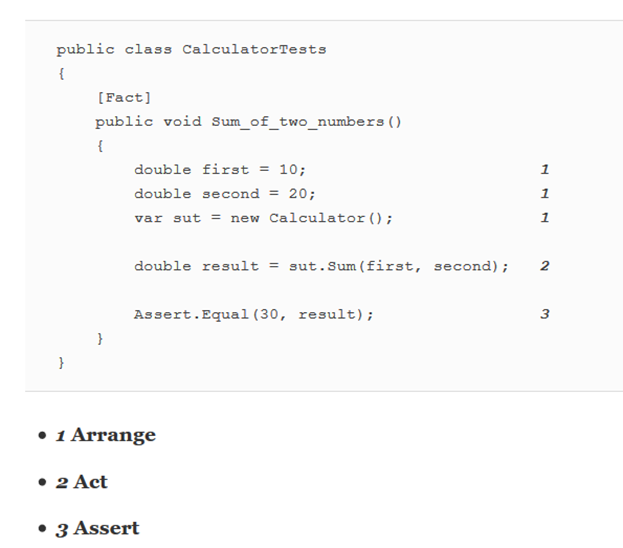

obr. 2 Ukázka oddělení částí testu pro zajištění lepší čitelnosti (Khorikov a
Safari 2020)

## Proměnné

Tato podsekce popisuje nejlepší postupy pro práci a způsobu používání
proměnných.

Nejlepší postupy týkající se proměnných jsou následující:

-   Nahrazovat pevné hodnoty konstantami

-   Nepoužívat magická čísla

### Nahrazovat pevné hodnoty konstantami

Namísto pevných, nebo přímých hodnot, je doporučováno používat konstanty. Jednak
to přispívá lepší čitelnost a snazšímu pochopení a jednak to zbavuje kód
přebytečných duplicit, které by se jinak mezi testy opakovaly (viz. obr. 3)

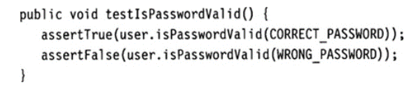

obr. 3 Příklad použití konstant namísto pevných hodnot (Link a Fröhlich 2003)

### Nepoužívat magická čísla

Problematika magických čísel souvisí také s konstantami. Namísto používání tzv.
magických čísel, tedy konkrétních hodnot, je lepší nahradit čísla konstantami
nebo proměnnými. Vhodně pojmenovaná konstanta či proměnná dává číslu význam a
zajišťuje snazší čitelnost kódu. Dalším způsobem je použít pomocnou metodu,
které předáme jako parametr číslo a metoda svým jménem dává číslu význam. Tento
postup je zejména výhodný v případě že se nám hodnoty čísel pro každý test mění
(viz. obr. 4).

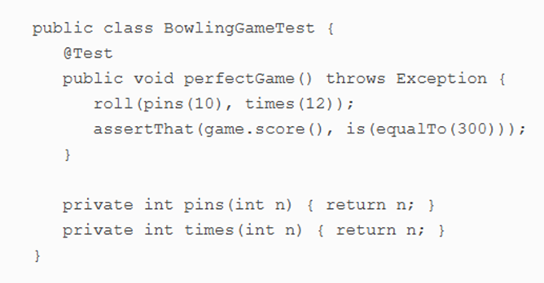

obr. 4 Příklad použití pomocné metody namísto magických čísel [(Koskela 2013)](#978-1-935182-57-3)

## Ostatní doporučení

Tato podsekce zahrnuje dodatečné nejlepší postupy týkající se tvorby
jednotkových testů.

Nejlepší postupy týkající se ostatních doporučení jsou následující:

-   Zachovávat spolehlivost testů

-   Odstraňovat mrtvý kód

-   Oddělovat generování dat od jejich verifikace

### Zachovávat spolehlivost testů

Testy by měly být konzistentní a měly by se chovat, jak je předpokládáno. Tím je
myšleno že při opakovaném spouštění testu, a aniž by došlo ke změně relevantních
částí kódu, by měl být výsledek vždy stejný. Testy, které mají čas od času jiný
výsledek jsou negativním příznakem a jsou často označovány jako „*Erratic
tests*“.

### Odstraňovat mrtvý kód

Mrtvý kód představuje přebytečnou část, která nafukuje testovací třídu a pouze
mate ostatní programátory. Příkladem mrtvého kódu jsou zakomentované testovací
metody. Doporučením je analyzovat příčinu zakomentování testu a pokud žádná
není, tak test vymazat.

### Oddělovat generování dat od jejich verifikace

Pokud máme velkou spoustu testovacích dat, jejich generování bychom měli oddělit
od verifikace. Testovací metoda by měla přijímat pouze parametry, ale sada dat
by měla být generována separátně. Příkladem jsou parametrizované testy v JUnit
verze 5 (viz obr.5)

obr.5 Příklad oddělení generování dat od verifikace (autor)
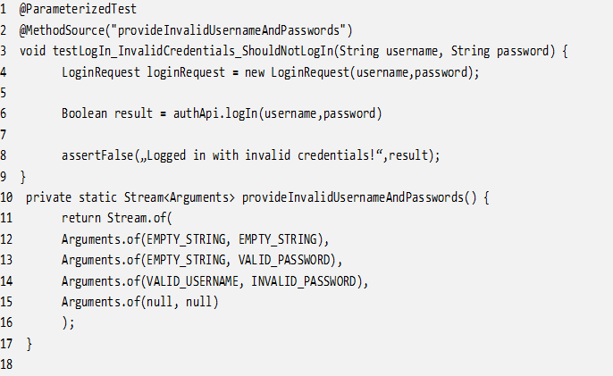

## Testování výjimek

Tato podsekce obsahuje nejlepší postupy pro testování výjimek vyhozených
testovaným systémem. Pokrývá jednak případy, kdy výjimky testujeme a jednak
případy kdy jsou pouze součástí testovacího kódu.

Nejlepší postupy týkající se testování výjimek jsou následující:

-   Odchytávat testované výjimky pomocí nástrojů knihoven či testovacích
    frameworků

-   Stanovovat obecnou úroveň pro výjimky testovací metody

<h3 id="odchytavat-testovane-vyjimky-pomoci-nastroju-knihoven-ci-testovacich-frameworku">Odchytávat testované výjimky pomocí nástrojů knihoven či testovacích frameworků</h3>

Testování vyhození výjimky testovaným systémem je možno standartně pomocí bloků
pro zachytávání výjimek *try* a *catch*. Tento způsob však není doporučován vede
k nafukování testovací metody a zhoršování čitelnosti testovacího kódu. Navíc
jak uvádí [(Koskela 2013)](#978-1-935182-57-3), tak tento přístup může také vést k tzv. *Testům co
nikdy neselžou* a to v případě kdy zapomeneme test nechat selhat pokud není
výjimka vyhozena nebo naopak výjimku utajíme.

Namísto toho je doporučeno využívat metod a možností použitého testovacího
frameworku či testovací knihovny. Příkladem je anotace @expectException pro
testovací framework JUnit verze 4 nebo ExpectedException pro testovací framework
*Visual Studio Test Systém.* Použití tohoto přístupu napomáhá lepší čitelnosti
testovacího kódu a také zajišťuje korektní chování.

### Stanovovat obecnou úroveň pro výjimky testovací metody

V případech, kdy vyhození výjimky není součástí testu, ale je možným produktem
některé z exekuovaných metod, tak bychom opět neměli používat bloky *try catch*,
ale výjimka by měla být zachycována samotnou testovací metodou. Důvod je opět
zlepšování čitelnosti testovacího kódu díky snížení jeho délky a také zajištění
korektního chování v případě vyhození výjimky. Výjimka tak bude zachycena
samotným testovacím frameworkem a test selže.

V tomto ohledu je také velmi důležité dbát na úroveň výjimky, kterou stanovíme
že bude testovací metoda zachytávat. Vždy by se mělo jednat o úroveň výjimky na
vrcholu hierarchie, tedy například pro programovací jazyk c++ se jedná o třídu
*exception*. Tento přístup zajistí že bude zachycena jakákoliv možná výjimka,
která by mohla být testovací metodou vyhozena.

<h2 id="podminena-logika">Podmíněná logika</h2>

Tato podsekce řeší otázku použití podmíněné logiky uvnitř testovacího kódu.

Nejlepší postupy týkající se podmíněné logiky jsou následující:

-   Nepoužívat bloky if, else, switch, for či while v rámci testu

### Nepoužívat bloky if, else, switch, for či while v rámci testu

Podmíněná logika v podobě if, else, for, či while by neměla být součástí
testovacího kodu. Obecně zvyšuje komplexnost testovací metody, což stěžuje jeho
srozumitelnost, čitelnost a je velmi těžké určit co je vlastně spouštěno a kdy.
Vede k přeskakování některých ověřovacích metod a dává tak iluzi správnosti
[(Koskela 2013)](#978-1-935182-57-3). Obecným řešením tohoto problému je extrakce všech podmíněných
větví do samostatných testů. Další možností je využití tzv. *Parametrizovaných
testů,* je každá možnost reprezentována jednou sadou parametrů*.*

## Pojmenování

V rámci této podsekce obsahuje nejlepší postupy pro pojmenování testovacích
metod, testovacích tříd a obecná doporučení pro pojmenování. Správné pojmenování
je nesmírně důležité, jelikož napomáhá čitelnosti a srozumitelnosti testů. Z
dlouhodobého hlediska také napomáhá snazší udržovatelnosti testů, jelikož nám
jméno jasně naznačuje, co test vlastně testuje.

Nejlepší postupy týkající se pojmenování jsou následující:

-   Určit strategii pojmenování testů

-   Zachovat konzistentní pojmenování testů

-   Zachovávat jeden styl pojmenování pro koncept

-   Používat jména pro známá řešení

-   Používat vhodné pojmenování pro testovací třídy

-   Používat vyslovitelné a vyhledatelné názvy

-   Zamezovat dezinformaci

-   Dělat dostatečné rozdíly mezi jmény

-   Vynechávat nadbytečné součásti názvů

-   Používat jména vyjadřující záměr

<h3 id="urcit-strategii-pojmenovani-testu">Určit strategii pojmenování testů</h3>

Existuje několik doporučených strategií, které lze použít pro pojmenování testů.
Například (Langr et al. 2015) doporučuje způsoby:

-   *doingSomeOperationGeneratesSomeResult*

-   *someResultOccursUnderSomeCondition*

-   *given-when-then*

-   *givenSomeContextWhenDoingSomeBehaviorThenSomeResultOccurs*

Další literatura (Tarlinder 2016) navrhuje rozdělení názvu na 3 části
*whatIsTested_contitions_expectedResult.*

Zvolená strategie pojmenování je subjektivní, až už si však vybereme
kteroukoliv, klíčové je, aby název vyjadřoval:

1.  co je testováno

2.  jaké jsou podmínky, data pro test

3.  jaký je předpokládaný výsledek testu

### Zachovat konzistentní pojmenování testů

Ať už si zvolíme kteroukoliv strategii pojmenování testovacích metod, je nutné
se jí držet a konzistentně daným způsobem pojmenovávat všechny testy. Pokud by
byl každý test pojmenován jiným, byť i správným způsobem, bude pro jeho čtenáře
mnohem náročnější pochopit fungování testů a testy jako celek.

### Zachovávat jeden styl pojmenování pro koncept

Pro určitý koncept je obecně doporučováné požívat pouze jeden styl pojmenování.
Je velmi matoucí, pokud v jednom testu použijeme pro jednu pomocnou metodu, jež
vytváří objekt prefix create a pro další build. Ve čtenáři testů to následně
bude vyvolávat otázku, zda se metoda s prefixem create nějak liší od metody s
prefixem build, bude muset metodu prozkoumávat a v konečném důsledku to povede k
prodloužení tvorby testů či pochopení testů stávajících.

### Používat jména pro známá řešení

Toto doporučení je úzce spjato s předcházejícím. Pro koncepty, které jsou obecně
známé a jsou tvořeny stejným způsobem bychom měli používat obvyklá jména.
Příkladem je pokud v rámci testů používáme návrhový vzor Builder, který je
pomocným vzorem pro konstruování složitých objektu. Namísto standartního
pojmenování stylem „JménoObjektuBuilder“ bychom jej zakončili sufixem creator,
nebo jiným ekvivalentem. Opět se jedná o matoucí název, který vyžaduje
procházení implementace a stěžuje práci při tvorbě či čtení testů.

### Používat vhodné pojmenování pro testovací třídy

Jméno testovací třídy je doporučováno zakončit sufixem „Test“. Tento způsob
jasně označuje, které třídy jsou testovací a také v řadě případů hraje roli pro
nástroje, které testy spouštějí.

### Používat vyslovitelné a vyhledatelné názvy

Ať už se jedná o názvy metod, tříd, či proměnných, obecně by měla být použitá
jména snadno vyslovitelná i vyhledatelná. Jednak to napomáhá lepšímu
zapamatování a jednak to usnadňuje komunikaci mezi lidmi, kteří s testy pracují.

### Zamezovat dezinformaci

Jméno metody či proměnné by nemělo mystifikovat a mělo by vyjadřovat co ve
skutečnosti reprezentuje. Příkladem může být proměnná pojmenovaná
*activationDate***,** která je ve skutečnosti typu long a reprezentuje datum v
podobě milisekund. V tomto případě název zavádí a vhodnější by bylo pojmenovat
proměnnou *activationDateMilis*

### Dělat dostatečné rozdíly mezi jmény

Pro rozdílné koncepty bychom vždy měli používat odlišná jména. Příkladem jsou
dva parametry reprezentující zdroj a cíl, které jsou pojmenované *a1* a *a2*.
Takové pojmenování je zcela nevhodné, protože může velmi snadno dojít k jejich
záměně. Pokud bychom je pojmenovali *source* a *destination,* záměna by byla
mnohem obtížnější [(Martin 2009)](#978-0-13-235088-4).

S tímto tématem souvisí také informační šum ve jménech. Například pokud
vytvoříme dvě třídy *ProductInfo* a *ProductData*. *Data* a *Info* znamená
vlastně to samé, ale jsou to dvě separátní třídy [(Martin 2009)](#978-0-13-235088-4).

### Vynechávat nadbytečné součásti názvů

Součástí názvů by neměly být přebytečné informace, které nepřidávají žádnou
přidanou hodnotu a pouze prodlužují dané jméno. Jedná se o ty části, které jsou
zcela zřejmé z kontextu použití a není je tedy potřeba uvádět. Příkladem je v
názvu proměnné používat slova jako *variable*, *constant* či *property*, v názvu
metody slova *method, function* a v názvu třídy slovo *class.*

### Používat jména vyjadřující záměr

Toto pravidlo úzce souvisí s výše zmíněným pravidly *Používat vyslovitelné a
vyhledatelné* názvy, *Zamezovat* dezinformac a hovoří o tom že názvy metod či
proměnných by vždy měly vyjadřovat záměr a mělo by být zřejmé za jakým účelem
byly vytvořeny.

## Uložení testovací souboru a seskupování testů

Tato podsekce obsahuje nejlepší postupy týkající se uložení testů a testovacích
souborů ve vývojovém prostředí.

Nejlepší postupy týkající se uložení testovací souboru a seskupování testů jsou
následující:

-   Ukládat testy mimo produkční kód

-   Ukládat testy pro jeden testovaný systém na jedno místo

### Ukládat testy mimo produkční kód

Jednotkové testy bychom vždy měli umisťovat mimo produkční kód. Jedním z častých
problémů je ukládání testů do stejné třídy jako je testovaný kód, to však vede k
řadě problémů:

-   Třída se po čase stane velmi dlouhou a nepřehlednou

-   Testy vyžadují importování dalších závislostí, a to zbytečně ovlivňuje
    velikost finálního balíčku při buildu aplikace

-   Exekuce testů je náročnější

Stejně tak vede k problémům ukládání testů sice do samostatného souboru, ale do
stejného balíčku jako testovaný kód:

-   Nepřehlednost balíčku, obtížně se naleznou soubory

-   Nafukování velikosti výsledného balíčku při buildu aplikace

Doporučeno je testy ukládat do samostatné hierarchie složek, která je zcela
oddělena od produkčního kódu. (Govindaraj 2015) uvádí dva populární způsoby
uložení testů. Prvním je uložení testů do samostatného balíčku, který je
součástí hlavního balíčku kódu (viz. obr. 6).

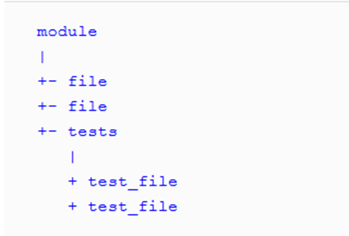

obr. 6 Ukázka uložení testů jako pod balíčku produkčního kódu (Govindaraj 2015)

Druhý způsob je znázorněn na obr. 7 a v tomto případě jsou testy uloženy v
samostatném balíčku, mimo balíček produkčního kódu.

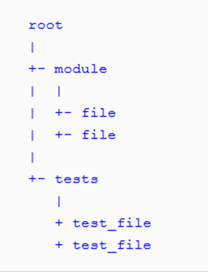

obr. 7 Uložení testů do separátního balíčku mimo balíček produkčního kódu
(Govindaraj 2015)

Vedle těchto dvou způsobů však existuje i třetí, který je však specifický pro
určité systémy, jako například Java. Ten umísťuje testy a produkční kód do
stejného balíčku, ale na rozdílná fyzická míst, tzn. nastavuje jim rozdílnou
kořenovou složku (viz obr. 8).

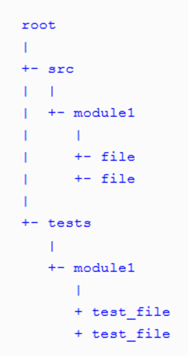

obr. 8 Uložení testů a kódu do stejných balíčků s rozdílnou kořenovou složkou
(Govindaraj 2015)

### Ukládat testy pro jeden testovaný systém na jedno místo

Obecně je doporučováno všechny testy týkající se určitého testovaného systému,
například testované třídy, bychom měli ukládat na jedno místo, do jedné
testovací třídy. Kniha (Link a Fröhlich 2003) však představuje případy kdy je
vhodné toto pravidlo porušit:

-   Množství testů v testovací třídě je příliš velké a třída se stává velice
    nepřehlednou, je měli bychom separovat testy se stejnými vlastnostmi do
    samostatných testovacích tříd. Obrovské množství testů také může nasvědčovat
    porušení principu jedné odpovědnosti v testovaném systému, a tedy bylo by
    dobré zvážit i rozdělení testovaného systému do více částí.

-   Předběžné kroky, např. v setUp metodě, se pro mnoho testů opakují a pro jiné
    ne. Tyto testy je vhodné separovat do samostatné testovací třídy.

## Nezávislost

Tato podsekce obsahuje nejlepší postupy pro zajištění nezávislosti testů.
Nezávislost testů je jednou ze základních vlastností jednotkového testu.
Vyjadřuje to, že by testy neměly záviset jeden na druhém. Jeden test by neměl
nastavovat podmínky pro následující test a každý test by měl být schopen běžet
nezávisle a v jakémkoliv pořadí [(Martin 2009)](#978-0-13-235088-4). Mimo rozsah této definice pokrývá
podsekce také širší aspekt nezávislosti testů z hlediska nezávislosti na
prostředí či produkčním kódu

Nejlepší postupy týkající se nezávislosti jsou následující:

-   Nepoužívat globální statické proměnné

-   Nepoužívat znalost domény

-   Používat relativní cesty

-   Nezávislost na platformě

-   Nezávislost na produkčním kódu

-   Tvořit vlastní data a zdroje

<h3 id="nepouzivat-globalni-staticke-promenne">Nepoužívat globální statické proměnné</h3>

Napříč jednotlivými testy bychom neměly používat a upravovat globální statické
proměnné. Testy sdílejí referenci na stejnou proměnnou a pokud ji některý
upraví, změní to podmínky pro test následující. Pokud je proměnná určena pouze
pro čtení, tak řešením je vytvořit z ní konstantu, a tím zajistit že ji nemůže
žádný z testů upravovat. Pokud je potřeba proměnnou upravovat a zároveň musí být
součástí více testů, je doporučeno převést ji proměnou na úrovni testovací třídy
a nastavit ji buď v testu samotném nebo pomocí tzv. hook metody, která je
spouštěna před každým testem. Pří použití hook metody je nutné proměnnou znovu
inicializovat.

### Nepoužívat znalost domény

Jedná se o případ, kdy používáme doménu, na níž testy vytváříme, pro stanovení
výsledku testu. Jednoduchým příkladem je třída, jež má metodu pro sčítání dvou
čísel. Špatným způsobem, jak metodu testovat je sečíst vstupní parametry v testu
a poté je očekávat jako výsledek (viz. obr. 9). Správně bychom však měly
výsledek vypočítat sami a rovnou jej dosazovat jako očekávaný výsledek (obr.
10).

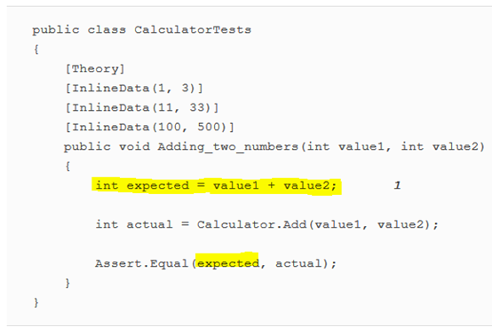

obr. 9 Ukázka porušení pravidla a používání znalosti domény (Khorikov a Safari
2020)

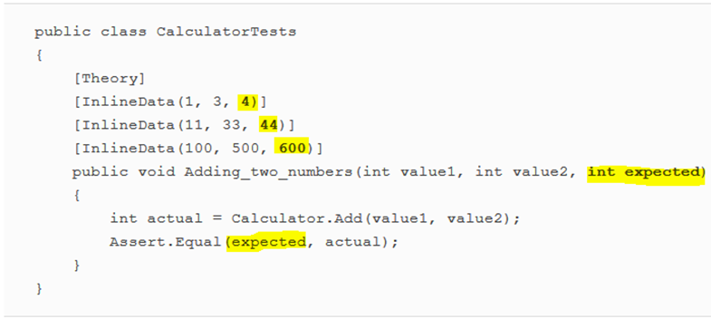

obr. 10 Ukázka správného testu, kde není použita znalost domény (Khorikov a
Safari 2020)

###  Používat relativní cesty

Součástí testů by nikdy neměli být absolutní cesty k používaným zdrojům. Zdroje
bychom měly ukládat na společné místo sdíleného projektu a odkazovat na ně
relativními cestami.

### Nezávislost na platformě

Často se v testu vyskytuje podmíněná logika, která rozlišuje, co a jak se bude
testovat v závislosti na použité platformě. Příklad špatného testu, který je
závislý na platformě, je ukázán na obr. 11. Jak je možné vidět, tak podle
operačního systému se mění ověřovací metody testu.

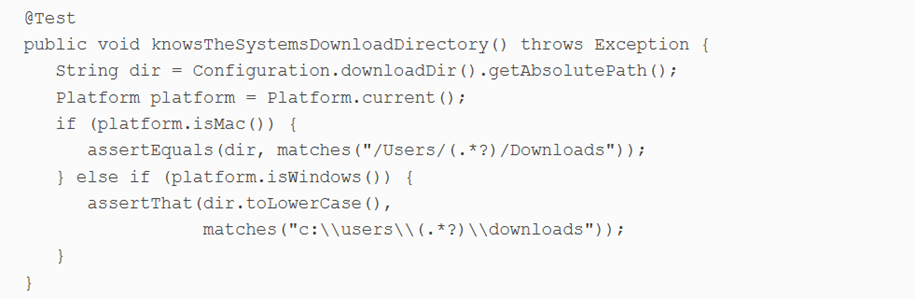

obr. 11 Příklad testu závislého na platformě [(Koskela 2013)](#978-1-935182-57-3)

Namísto tohoto postupu je doporučováno jednak test rozdělit na samostatné testy
a jednak zajištění prostředků pro spouštění testu nezávisle na platformě.
Příkladem je vytvoření vlastní třídy, jež bude představovat operační systém a na
ní poté pouštět test (viz obr. 12).

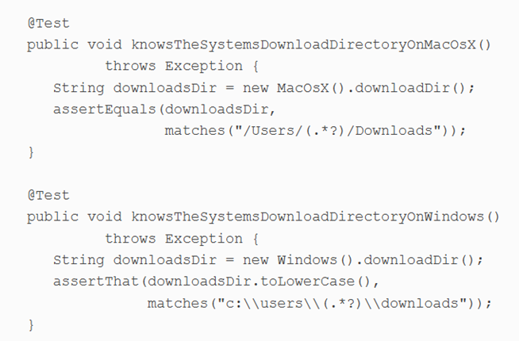

obr. 12 Příklad testu nezávislého na operačním systému [(Koskela 2013)](#978-1-935182-57-3)

### Dodržovat nezávislost na produkčním kódu

Testovací kód by v žádném případě neměl být součástí produkčního kódu. Stejně
tak by neměl produkční kód obsahovat metodu co je volaná jenom v rámci testů.

### Tvořit vlastní data a zdroje

Zdroje a data bychom měli vytvářet pro testy separátně a odděleně od testovaného
kódu. Příkladem mohou být konstanty jež jsou součástí testovaného kódu a
rozhodují o chování systému. Pokud v testech potřebujeme s touto konstantou
pracovat a na jejím základě například ověřovat správné chování systému, je nutné
ji zde vytvořit znovu.

## Izolovanost

Tato podsekce obsahuje nejlepší postupy pro zajištění izolovanosti testovaného
systému a zajištění vhodných podmínek pro jeho testování.

Nejlepší postupy týkající se izolovanosti jsou následující:

-   Používat správného testovacího dvojníka

-   Nepoužívat testovací dvojníky na testovaný systém

-   Nepoužívat návrhový vzor Singleton

### Používat správného testovacího dvojníka

Používání dvojníků (v originále test double) má své bezesporné výhody. Umožňuje
nám to vytvořit ideální podmínky pro otestování dané třídy, či objektu. Můžeme
díky nim simulovat určité chování, testy zrychlit, získat přístup ke skrytým
informacím, z nedeterministického chování udělat deterministické atd. Tvorba
dvojníků nám umožňuje izolovat testovaný systém, snížit rozsah pouze na jedno
chování, které právě chceme testovat.

Jak ukazuje obr. 13, tak existují celkem 4 typy testovacích dvojníků. Použití
každého z nich se hodí v závislosti na daném kontextu a obecně nelze říct, který
by byl nejlepší. [(Koskela 2013)](#978-1-935182-57-3) specifikuje základní doporučení, kdy jednotlivé
typy používat (viz. Tabulka 1).

Tabulka 1 Popis a použití testovacích dvojníků (autor a [(Koskela 2013)](#978-1-935182-57-3))

| Název | Popis                                                                                                                 | Kdy použít                                                                                                                                                                                                       |
|-------|-----------------------------------------------------------------------------------------------------------------------|------------------------------------------------------------------------------------------------------------------------------------------------------------------------------------------------------------------|
| Mock  | Speciální případ Spy objektu. Je nakonfigurován tak, aby se choval specificky za specifických podmínek.               | V případě, kdy dochází k interakci mezi objekty v podobě volání metod.                                                                                                                                           |
| Spy   | Skrze své aplikační rozhraní odhaluje, co se v testovaném systému stalo a snáze tak otestovat chování                 | Použití mock objektu způsobuje zhoršení čitelnosti a srozumitelnost testovacího kódu.                                                                                                                            |
| Stub  | Slouží k zamezení provádění funkcionality, která nás pro účely testu nezajímá nebo ještě nebyla naprogramována        | Máme zájem na přítomnosti spolupracujících objektů nebo dodávání dat testovaným systémům.                                                                                                                        |
| Fake  | Simuluje chování testovaného sytému, ale bez vedlejších efektů a dalších dopadů, které by jeho použití mohlo způsobit | chceme pouštět komplexní scénář, který závisí na službě, nebo komponentě jež je nedostupná nebo nemožná k použití pro účely testu a mockování všech interakcí by vedlo k velmi komplexnímu a nepřehlednému kódu. |

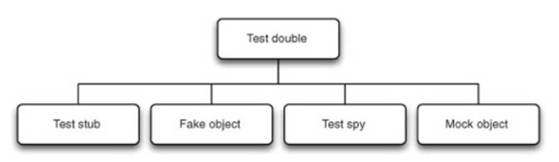

obr. 13 Typy testovacích dvojníků [(Koskela 2013)](#978-1-935182-57-3)

### Nepoužívat testovací dvojníky na testovaný systém

Nijak bychom neměli modifikovat či měnit systém, který testujeme. Testovací
dvojník by nikdy neměl být použit na systém, který testujeme.

### Nepoužívat návrhový vzor Singleton

Singletony představují pro testování velký problém. Jedná se o poměrné dobrý
návrhový vzor, když ale přijde na testování, tak přináší komplikace. Problém je
že se jedná v podstatě o globální proměnou, na kterou máme pouze právo čtení a
nemůžeme ovlivňovat její vnitřní stav, či ji inicializovat. Pro testování to
představuje dva problémy:

-   Musíme se ujistit, že umístíme požadované singletony do správného stavu na
    začátku testu a nahradíme originál

-   Každá test může vyžadovat trochu jinou konfiguraci, což může vést k velkému
    množství kódu

Řešením je vyhnout se používání singletonů. Princip singleton objektů je jejich
exkluzivita ve specifickém kontextu. Tento kontext může být systém, uživatel
nebo session. Místo tvorby signeltonu můžeme využít tohoto pricipu a použít
systémový, uživatelský nebo session objekt k tomu, aby nám dal přístup k
objektů, které by jinak byli sigletony (Link a Fröhlich 2003).

# Vymezení testů

Tato podkapitola obsahuje nejlepší postupy týkající vymezování jednotkových
test. Pomyslně odpovídá na otázku „Co by mělo být testováno?“, tedy jaké by měly
být jednotlivé testovací případy a podle čeho bychom je měli vymezovat.
Podkapitola je dále rozpadnuta do několika podsekcí, které vymezují nejlepší
postupy týkající se určitého aspektu vymezení testovacích případů.

## Pokrytí kódu (Code coverage)

Tato podsekce obsahuje nejlepší postupy pro zajištění správného pokrytí kódu
jednotkovými testy. Je zde vymezeno, které části a oblasti je nezbytné testovat
a jak přemýšlet při vymezování testovacích případů.

Nejlepší postupy týkající se pokrytí kódu (Code coverage) jsou následující:

-   Neimplementovat jednoduché testy

-   Implementovat jak happy, tak sad testy

-   Implementovat testy pro každý netriviální systém

-   Netestovat abstraktní systémy

-   Testovat pouze veřejné chování testovaného systému

-   Testovat chování, ne metody systému

-   Zachovávat princip jedné odpovědnosti testu

### Neimplementovat jednoduché testy

Obecně je doporučováno nevytvářet testy pro primitivní funkcionality testovaného
systému. Příkladem jsou get a set metody, které jsou obecně používaným principem
pro získávání hodnot parametrů a nastavování hodnot parametrů objektů. Testování
těchto velmi jednoduchých metod je zbytečně, protože jsou prakticky imunní vůči
chybě. Pokud je však s nimi svázaná nějaká komplexnější logika, jež by mohla
vést k vedlejším účinkům, je vhodné i pro tyto metody napsat jednotkový test.

### Implementovat jak happy, tak sad testy

Při vytváření jednotkových testů pro určitý systém, bychom měli vytvářet jak
happy testy, tedy test správného fungování testované funkcionality, tak sad
testy, tedy testy, jež se snaží rozbít systém a očekávají adekvátní reakci na
toto nesprávné použití funkcionality.

### Implementovat testy pro každý netriviální systém

Obecně platí pravidlo, že pro každý netriviální systém bychom měli vytvářet
jednotkové testy. Základní otázkou, kterou bychom si měli klást je „Má systém
uvnitř vlastní logiku?“

### Netestovat abstraktní systémy

Ve většině případů se testování abstraktních tříd nevyplácí. Jednou možností je
vytvoření specifické podtřídy čistě pro účely testování. Zřídka kdy je však
komplexita abstraktní třídy taková, aby se to vyplatilo. Doporučuje spíše
provést další inspekce kodu. Obecně však platí že tento postup je nutné
aplikovat v případě, že máme pouze abstraktní třídu a ta zatím nemá žádné
potomky.

<h3 id="testovat-pouze-verejne-chovani-testovaneho-systemu">Testovat pouze veřejné chování testovaného systému</h3>

Platí doporučení, že bychom vždy měli vždy testovat pouze veřejné chování
testovaného systému, které bývá vyjádřeno pomocí veřejných metod. Implementace
privátních metod či metod privátních pro balíček je velmi často měněna, metody
jsou mazány či přidávány, a to nezávisle na chování systému jako celku. Privátní
metody jsou pouze pomocným nástrojem pro zajištění veřejného chování testovaného
systému. Jejich testování vytváří velké množství závislostí mezi kódem a testy a
z dlouhodobého hlediska to vede k obtížné udržovatelnosti testů a nutnosti
jejich časté úpravy a aktualizace. (Khorikov 2020) a (Langr et al. 2015) uvádí,
že pokud obsahují privátní metody komplexní chování a zdá se, že by mělo smysl
pro ně samostatný test napsat, jedná se o ukázku chyby v návrhu daného systému a
porušení principu jedné odpovědnosti (Single Responsibility Principle). Takové
chování by tedy mělo být vyextrahováno do samostatné třídy a testovaný systém by
s ní měl pouze komunikovat.

Výjimkou z tohoto principu je situace, kdy je privátní metoda součástí
pozorovaného chování systému. Například pokud máme privátní konstruktor třídy,
která je součástí ORM knihovny a její inicializace by neměla být povolena. V
takovém případě je privátnost součástí pozorovaného chování a konstruktor by měl
zůstat privátní (Khorikov 2020).

### Testovat chování, ne metody systému

Při specifikaci jednotkových testů je nutné používat holistický pohled a
testovat chování testovaného systému, ne jeho individuální metody.

### Zachovávat princip jedné odpovědnosti testu

Stejně jako při psaní produkčního kódu, kde je princip jedné odpovědnosti jedním
ze základních pravidel, je doporučováno toho pravidla dbát i při psaní
jednotkových testů. I pouze jedna testovaná komponenta v sobě může zahrnovat
více malých funkcionalit, nebo funkcí. Důležité je v rámci testu zohledňovat
pouze jednu tuto dílčí funkcionalitu či chování, jelikož se pak testy snáze
udržují a také se snáze odhalují problémy, pokud testy selhávají (Meszaros
2007).

## Datové pokrytí (Data coverage)

V rámci této podsekce jsou vymezeny nejlepší postupy týkající se volení vhodných
dat při specifikaci testovacích systému. Vhodné zvolení dat vede k zajištění
dostatečného datového pokrytí testovaného systému a neopomenutí důležitých
testovacích scénářů.

Nejlepší postupy týkající se datového pokrytí (Data coverage) jsou následující:

-   Testovat hraniční podmínky

-   Kontrolovat inverzní vztahy

-   Kontrolovat inverzní vztahy

-   Provádět křížovou kontrolu s pomocí jiných prostředků

-   Vynucovat chybné podmínky

-   Používat jednotkové testy pro měření výkonových charakteristik testovaného
    systému

-   Vymezovat třídy ekvivalence

-   Testovat krajní hodnoty

-   Testovat změny stavu

-   Testovat pomocí rozhodovacích tabulek

### Testovat hraniční podmínky

Mnoho chyb v kódu velmi často vzniká vlivem mezních hodnot povolené podoby dat.
Jeden obyčejný *„happy day“* scénář na takové problémy nenarazí. Je proto
doporučováno testovat hraniční podmínky vstupních dat. (Langr et al. 2015)
vymezuje akronym **CORRECT**, který napomáhá zapamatování si vhodného přemýšlení
o hraničních podmínkách jednotkových testů (viz Tabulka 4).

Tabulka 4 Popis dílčích částí akronymu CORRECT (autor a (Langr et al. 2015))

| Conformance-Shoda                                                                                                                                                                                                                                                                                                                                                                                                                                                                                                                                                                                                                                                                                                                                                                                                                                                                                                                                                                                                                                                                                                                                                                                        |
|----------------------------------------------------------------------------------------------------------------------------------------------------------------------------------------------------------------------------------------------------------------------------------------------------------------------------------------------------------------------------------------------------------------------------------------------------------------------------------------------------------------------------------------------------------------------------------------------------------------------------------------------------------------------------------------------------------------------------------------------------------------------------------------------------------------------------------------------------------------------------------------------------------------------------------------------------------------------------------------------------------------------------------------------------------------------------------------------------------------------------------------------------------------------------------------------------------|
| Data velmi často musejí splňovat nějaký formát, aby byla validní. Může se tak například jednat o emailovou adresu, uživatelské jméno, název souboru, telefonní číslo apod. Pokud je struktura dat velmi komplexní může to vést k extrémnímu počtu kombinací k otestování (Kniha toto nenaznačuje, ale jedná se o mou myšlenku. S velkým množstvím kombinací může velmi napomoct využití parametrizovaných testů, jako například nabízí JUnit5. Zde je možné velmi jednoduše vytvořit stovky testovacích napsáním pár řádků kódu). Stejná data mohou být v našem systému používána mnoha funkcionalitami. Není však potřeba testovat jejich správný formát úplně všude, ale zaměřit se pouze na míst kdy data do systému vstupují, zde provést kontrolu a nadále již není potřeba (Opět má myšlenka. Stejně tak je potřeba data kontrolovat na výstupu funkcí jež je nějakým způsobem mění či upravují).                                                                                                                                                                                                                                                                                                  |
| **Order-Pořadí**                                                                                                                                                                                                                                                                                                                                                                                                                                                                                                                                                                                                                                                                                                                                                                                                                                                                                                                                                                                                                                                                                                                                                                                         |
| Správné pořadí dat v kolekci je jedním z předpokladů, který může být v kódu snadno porušen. Pokud tedy testujeme nějakou kolekci, kde je důležité pořadí, je vhodné vytvořit testy jež pořadí testují.                                                                                                                                                                                                                                                                                                                                                                                                                                                                                                                                                                                                                                                                                                                                                                                                                                                                                                                                                                                                   |
| **Range-Rozsah**                                                                                                                                                                                                                                                                                                                                                                                                                                                                                                                                                                                                                                                                                                                                                                                                                                                                                                                                                                                                                                                                                                                                                                                         |
| Je důležité se zaměřit na povolený rozsah hodnot proměnné. V řadě případů je velmi nevhodné používat primitivní datové typy pro hodnoty s omezeným rozsahem, jelikož pak může velmi snadno nastat chyba a dostaneme se mimo povolený rozsah. Příkladem je například věk, nebo úhel. Tomuto se dá předejít vytvořením vlastního datového typu, který nepovolí překročení dovoleného rozsahu.                                                                                                                                                                                                                                                                                                                                                                                                                                                                                                                                                                                                                                                                                                                                                                                                              |
| **Reference**                                                                                                                                                                                                                                                                                                                                                                                                                                                                                                                                                                                                                                                                                                                                                                                                                                                                                                                                                                                                                                                                                                                                                                                            |
| Při testování metody je nutné zvážit na co odkazuje mimo rámec své působnosti, jaké má externí závislosti, jestli závisí na tom, zda je objekt v určitém stavu a zda musejí být splněny nějaké další podmínky. Například pro zobrazení účtu uživatele musí být uživatel přihlášen apod. Měli potom vytvářet testy tak abychom ověřili že se daná třída nebo zkrátka testovaný kus kódu chová správně i když některé podmínky nejsou splněny, protože jsme usoudili že logicky nejsou potřeba. Je ale vhodné takové stavy ověřovat a předejít tak nepředvídatelnému chování.                                                                                                                                                                                                                                                                                                                                                                                                                                                                                                                                                                                                                              |
| **Existence**                                                                                                                                                                                                                                                                                                                                                                                                                                                                                                                                                                                                                                                                                                                                                                                                                                                                                                                                                                                                                                                                                                                                                                                            |
| Je důležité klást si otázku, zda musí určitá věc vždy existovat. Obvykle mají programátoři tendenci psát pouze „happy day“ testy, je však také důležité zamyslet se nad tím jaké vstupní parametry se mohou do metody dostat. Co se stane, pokud je vstupní parametr null, soubor neexistuje apod.?                                                                                                                                                                                                                                                                                                                                                                                                                                                                                                                                                                                                                                                                                                                                                                                                                                                                                                      |
| **Cardinality – kardinalita**                                                                                                                                                                                                                                                                                                                                                                                                                                                                                                                                                                                                                                                                                                                                                                                                                                                                                                                                                                                                                                                                                                                                                                            |
| Zásada pojednává o četnosti či mohutnosti a chyby, ke kterým se často můžeme dostat. Jedná se o tzv. fencepost errors nebo také off-by-one error, což je typ chyby kdy se můžeme splést v důsledku fatální podmínky, které podlehneme. Při psaní testů bychom se měli zamyslet nad tím, jak se v našem kódu počítá, jaký výskyt určité věci můžeme mít, a jaký to má vliv. Výskyt lze zobecnit na 3 případy: Nula – nemáme nic, tedy speciální případ předchozího pravidla **Existence** Jedna – pouze jeden výskyt Mnoho – více jak jedna V angličtině se toto pravidlo nazývá jako **0-1-n** pravidlo, nebo také **ZOM (Zero,One,Many).** Je zde uveden příklad se seznamem top 10 jídel nějaké restaurace. Pokaždé co je vzata nějaká objednávka měl by se list v reálném čase updatovat. Pravidlo kardinality je v tomto případě aplikováno na specifikaci vhodných testovacích případů: Tvorba reportu, pokud v seznamu není žádné jídlo Tvorba reportu, pokud v seznamu je pouze jedno jídlo Tvorba reportu, pokud v seznamu není ještě 10 jídel  Atd…                                                                                                                                             |
| **Time - čas**                                                                                                                                                                                                                                                                                                                                                                                                                                                                                                                                                                                                                                                                                                                                                                                                                                                                                                                                                                                                                                                                                                                                                                                           |
| V souvislosti s pravidlem času je nutné si uvědomit 3 věci: **Relativní čas** – správné pořadí volání v čase Některá rozhraní jsou závislá na stavu a očekávají že se nejprve uživatel přihlásí a poté se až může odhlásit apod. Je důležité se nad tím zamyslet a přidávat testy, které pořadí porušují a očekávají chybu apod. Podobně jaké pravidlo O - ordering, kde záleží na pořadí dat, tak stejně tak záleží i na pořadí volání metod. **Absolutní čas** – uběhnutý čas, aktuální čas V souvislosti s pořadím volání se také mohou vyskytnou čekání na dostupnost zdroje. Je nutné hledat místa v kódu, kde by se potenciálně mohlo čekat na věky. Také je vhodné na určitých místech uplynutý čas měřit, a rozhodovat, zda je čekání až moc dlouhé. Aktuální čas je také velmi důležité kontrolovat. V závislosti na aktuálním čase se mohou podmínky lišit a některé testy tak nemusí vždy fungovat. Nespoléhat se na to že knihovny, které používáme tyto problémy mají ošetřené! **Problémy s konkurencí**  Je důležité si položit otázku, co se stane, pokud bude s tímto zdrojem pracovat více vláken najednou? Je to možné, může to nastat? Je potřeba synchronizovat globální proměnné?  |

### Kontrolovat inverzní vztahy

V některých případech je možné a samozřejmě vhodné otestovat inverzní chování
dané funkcionality. Příkladem je, pokud máme implementovanou matematickou funkci
pro výpočet druhé mocniny čísla. Inverzní test by poté spočíval v tom, že bychom
spočítali kořen nějakého čísla a poté testovali že použitím funkce pro výpočet
druhé mocniny ke stejnému číslu (Langr et al. 2015).

### Provádět křížovou kontrolu s pomocí jiných prostředků

Jedná se o podobný přístup jako v předchozím bodě, ale používáme jiné prostředky
než vlastní. Může se jednat o nějakou externí knihovnu, nebo používání různých
kusů dat z testované třídy proto abychom zjistili, zda vše dohromady sedí (Langr
et al. 2015).

### Vynucovat chybné podmínky

Tento princip je o simulování chybných podmínek, které mohou v reálném světe
nastat. Může se například jednat o:

-   Nedostatek paměti

-   Nedostatek místa na disku

-   Dostupnost sítě apod.

Správný jednotkový test by neměl pouze testovat logické správné cesty, ale také
zjišťovat, jak se kód chová za chybných podmínek, respektive jestli se chová tak
jak očekáváme (Langr et al. 2015).

### Používat jednotkové testy pro měření výkonových charakteristik testovaného systému

Není vhodné vytvářet složité výkonové testy, které poběží velmi dlouho. Budou
narušovat ostatní jednotkové testy, které splňují základní zásady jednotkového
testu a běží velmi rychlé. Samozřejmě výkonnostní testy jsou důležité a jsou
potřeba, je ale lepší je spouštět odděleně od jednotkových testů. Jednotkové
testy však v tomto ohledu mohou být nápomocné. Mohou být použity pro poskytnutí
základní informace o výkonnosti nějaké funkce a tato informace bude následně
využita pro vytvoření výkonnostních testů (Langr et al. 2015).

### Vymezovat třídy ekvivalence

Pokud testovaný systém přijímá hodnoty v určitém stanoveném rozsahu, bylo by
psaní pro každou hodnotu velmi neefektivní a také zbytečné. Jednou z metod, jak
tomu předejít je určení skupin testovacích hodnot, které jsou ekvivalentní
neboli stačí napsat test pro každou ekvivalentní skupinu a nepsat zbytečně testy
pro prvky, které jsou si rovny. Příkladem může být funkce pro výpočet
rizikovosti pojištěných řidičů. Rozdělení může být podle věku na mladé (18-24),
střední věk (24-60) a staré (nad 60 až 100) a každý skupina představuje jiné
riziko. Stačí pak napsat pouze 3 testy pro každou ze skupin a dále můžeme napsat
ještě dva testy pro neplatné hodnoty tedy mladší 18 let a starší 100 (Tarlinder
2016).

### Testovat krajní hodnoty

Pokud není možné v rámci rozsahu nalézt určité skupiny ekvivalence, je místo
doporučováno specifikovat testovací případy pro krajní hodnoty povoleného
rozsahu. Princip je velmi jednoduchý, pokud máme například povolený rozsah
**0-100** včetně, vytvoříme testy pro hodnoty **-1,0,100,101**. Tímto způsobem
zajistíme dostatečné otestování jak pozitivních, tak negativních případů, bez
testování zbytečných případů.

### Testovat změny stavu

V případě že v testovaném systému dochází ke změnám stavu, je vhodné vymezovat
jednotlivé testovací případy na základě stavového diagramu. Příklad takového
diagramu je zachycen na obr. 14. Zachycení jednotlivých stavů a jejich
vzájemných přechodů nám umožňuje snadno vymezit jednotlivé testovací případy.

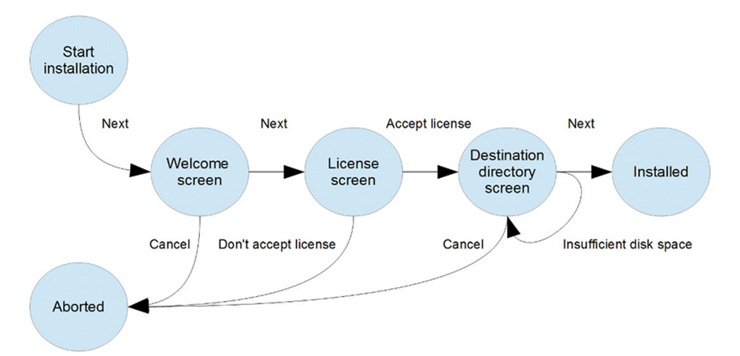

obr. 14 Ukázka stavového diagramu (Tarlinder 2016)

### Testovat pomocí rozhodovacích tabulek

V případě, kdy je potřeba otestovat veškeré varianty a neopomenou ani jeden
případ, je doporučováno použít rozhodovací tabulku. Tento nástroj je velmi
vhodný pro tvorbu parametrizovaných testů. Řada testovacích frameworku (např.
Cucumber, JUnit5 či Spoc), poskytuje podporu pro tvorbu parametrizovaných testů
s pomocí rozhodovacích tabulek. Příklad takové rozhodovací tabulky je zobrazen
na obr. 15. Tabulka stanovuje, jaká je výše pojistného faktoru a zda bude
zahájeno vyšetřování pro podezření z podvodu, na základě věku a pohlaví klienta.

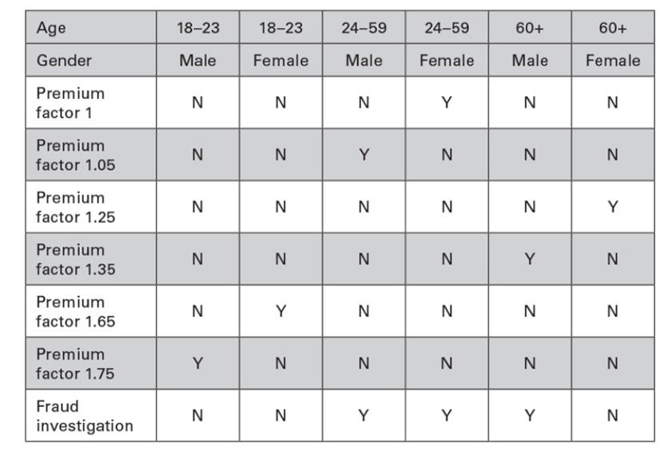

obr. 15 Rozhodovací tabulky pro určení pojistného faktoru a vyšetření podvodu
(Tarlinder 2016)

Tabulku je poté možné použít pro vymezení jednotkových testů pro otestování
pomocné metody, jež faktor pojistného vypočítává (viz obr.16).

obr. 16 Ukázka použití rozhodovací tabulky pro specifikaci testovacích případů
(autor)

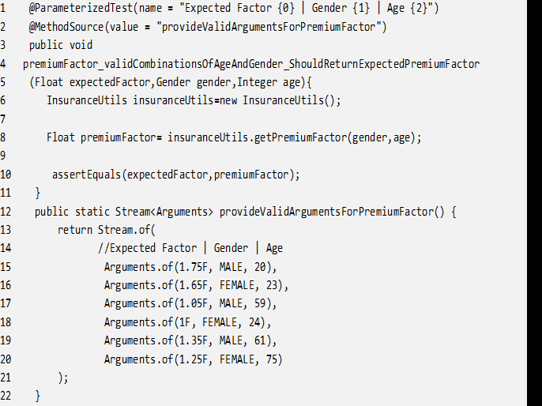

## Literatura

KOSKELA, Lasse, 2013. Effective unit testing: a guide for Java developers. Shelter Island, NY: Manning. ISBN 978-1-935182-57-3

MARTIN, Robert C., ed., 2009. Clean code: a handbook of agile software craftsmanship. Upper Saddle River, NJ: Prentice Hall. ISBN 978-0-13-235088-4.

