# Table of contents

[Definition of the term "Best Practice"](#definition-of-the-term-best-practices)

[How "best practices" have been defined](#how-best-practices-have-been-defined)

[Creating tests](#creating-tests)

>   [Duplicates](#duplicates)

>>[Extract duplicate parts of the test code](#extract-duplicate-parts-of-the-test-code)

>> [Extract duplicate methods](#extract-duplicate-methods)

>   [Speed](#speed)

>> [Using in-memory resources and mocking](#using-in-memory-resources-and-mocking)

>> [Avoid actions that are blocking the main thread](#avoid-actions-that-are-blocking-the-main-thread)

>   [Assertions](#assertions)

>> [At least one assertion per test](#at-least-one-assertion-per-test)

>> [Only one assertion per test](#only-one-assertion-per-test)

>> [Do not use Guard Assertions](#do-not-use-guard-assertions)

>> [Keep the right order of the assertion method parameters](#keep-the-right-order-of-the-assertion-method-parameters)

>> [Use  messages describing the error](#use-messages-describing-the-error)

>   [Structure of the test method](#structure-of-the-test-method)

>> [3-phase test design](#3-phase-test-design)

>> [4-phase test design](#4-phase-test-design)

>> [Do not repeat the test phases](#do-not-repeat-the-test-phases)

>> [Separate the test phases](#separate-the-test-phases)

>   [Variables](#variables)

>> [Replace fixed values with constants](#replace-fixed-values-with-constants)

>> [Do not use magic numbers](#do-not-use-magic-numbers)

>   [Other "Best Practices"](#other-best-practices)

>> [Keep the tests reliable](#keep-the-tests-reliable)

>> [Delete dead code](#delete-dead-code)

>> [Separate data generating from its asserting](#separate-data-generating-from-its-asserting)

>   [Testing exceptions](#testing-exceptions)

>> [Catch tested exceptions using framework or library tools](#catch-tested-exceptions-using-framework-or-library-tools)

>> [Set general level for the test exception](#set-general-level-for-the-test-exception)

>   [Conditional logic](#conditional-logic)

>> [Do not use if, switch, for or while blocks in a test](#do-not-use-if-switch-for-or-while-blocks-in-a-test)

>   [Naming conventions](#naming-conventions)

>> [Setup a test naming strategy](#setup-a-test-naming-strategy)

>> [Maintain consistent test naming](#maintaint-consistent-test-naming)

>> [Use one naming strategy for the concept](#use-one-naming-strategy-for-the-concept)

>> [Use "known solution" names](#use-"known-solution"-names)

>> [Use appropriate names for test classes](#use-appropriate-names-for-test-classes)

>> [Use pronounceable and searchable names](#use-pronounceable-and-searchable-names)

>> [Prevent misinformation](#prevent-misinformation)

>> [Use sufficiently distinct names](#use-sufficiently-distinct-names)

>> [Omit redundant name parts](#omit-redundant-name-parts)

>> [Use intent revealing names](#use-intent-revealing-names)

>   [Storing test files and grouping tests](#storing-test-files-and-grouping-tests)

>> [Keep tests outside of production code](#keep-test-outside-of-production-code)

>> [Store tests for one system under test in one place](#store-tests-for-one-system-under-test-in-one-place)

>   [Independence](#nezávislost)

>> [Do not use global static properties](#nepouzivat-globalni-staticke-promenne)

>> [Do not the domain knowledge](#nepoužívat-znalost-domény)

>> [Use relative paths](#používat-relativní-cesty)

>> [Keep tests platform independent](#nezávislost-na-platformě)

>> [Keep tests independent of production code](#dodržovat-nezávislost-na-produkčním-kódu)

>> [Create your own data and resources](#tvořit-vlastní-data-a-zdroje)

>   [Isolation](#izolovanost)

>> [Use the right test double](#používat-správného-testovacího-dvojníka)

>> [Do not use test double on the system under the test](#nepoužívat-testovací-dvojníky-na-testovaný-systém)

>> [Do not use the Singleton design pattern](#nepoužívat-návrhový-vzor-singleton)

[Defining tests](#vymezení-testů)

>   [Code coverage](#pokrytí-kódu-(code-coverage))

>> [Do not define tests for primitive behavior](#neimplementovat-jednoduché-testy)

>> [Implement both happy and sad tests](#implementovat-jak-happy,-tak-sad-testy)

>> [Do not test abstract systems](#netestovat-abstraktní-systémy)

>> [Test only the public behavior of the tested system](#testovat-pouze-verejne-chovani-testovaneho-systemu)

>> [Test behavior, not system methods](#testovat-chování,-ne-metody-systému)

>> [Make the tests follow the single responsibility principle ](#zachovávat-princip-jedné-odpovědnosti-testu)

>   [Data coverage](#datové-pokrytí-(data-coverage))

>> [Test boundary conditions](#testovat-hraniční-podmínky)

>> [Assert inverse relationships](#kontrolovat-inverzní-vztahy)

>> [Do cross-checking using external means](#provádět-křížovou-kontrolu-s-pomocí-jiných-prostředků)

>> [Enforce bad conditions](#vynucovat-chybné-podmínky)

>> [Use unit tests to measure the performance characteristics of the tested system](#používat-jednotkové-testy-pro-měření-výkonových-charakteristik-testovaného-systému)

>> [Test equivalence classes](#vymezovat-třídy-ekvivalence)

>> [Test extreme values](#testovat-krajní-hodnoty)

>> [Test the state transitions](#testovat-změny-stavu)

>> [Test using decision tables](#testovat-pomocí-rozhodovacích-tabulek)

****

<h1 id="definition-of-the-term-best-practices">Definition of the term "Best Practices"</h1>
The Cambridge Dictionary defines the term Best Practice as follows: 

> „A working method or set of working methods that is officially accepted as being the best to use in a particular business or industry, usually described formally and in detail.“ [(Cambridge Dictionary 2020)](#Best_practice_definition_cambridge_dictionary_2020)

The definition from the Merriam-Webster web portal is a bit more specific and defines the term as follows:

> „A procedure that has been shown by research and experience to produce optimal results and that is established or proposed as a standard suitable for widespread adoption.“ [(Merriam-Webster 1927)](#Best_practice_definition_merriam_webster_1927)

As we can see, the second definition is a bit more specific and does not only speak in abstract terms of the general acceptance of the method, but suggests that this status has 
been gained through previous research and good experience from its application to other projects.

<h1 id="how-best-practices-have-been-defined">How "Best Practices" have been defined</h1>

Following sources were used to define "Best practices":

* xUnit Test Patterns: Refactoring Test Code [(Meszaros 2007)](#978-0-13-149505-0)
* Mastering Software Testing with JUnit 5 [(García 2017)](#978-1-78712-439-4)
* Modern C++ Programming with Test-Driven Development [(Langr a Swaine 2013)](#978-1-937785-48-2)
* Developer Testing: Building Quality into Software [(Tarlinder 2016)](#978-0-13-429106-2)
* Clean Code: A Handbook of Agile Software Craftsmanship [(Martin 2009)](#978-0-13-235088-4)
* Unit Testing Principles, Practices, and Patterns [(Khorikov 2020)](#978-1-61729-627-7)
* Unit Test frameworks [(Hamill 2004)](#978-0-596-00689-1)
* Pragmatic Unit Testing in Java 8  [(Langr et al. 2015)](#978-1-937785-48-2)
* Effective Unit Testing [(Koskela 2013)](#978-1-935182-57-3)
* Testing for Continuous Delivery with Visual Studio 2012
* Top 50 JUnit Unit Testing Interview Questions & Answers
* Professional Node.js
* Testing Python
* Python Testing Cookbook.
* Test-Driven Python Development
* Composing Software Components
* Prime Path Coverage Exploration for Automated Unit Testing
* Test-Driven iOS Development with Swift
* Mastering Unit Testing Using Mockito and JUnit
* SPA Design and Architecture
* Getting Started with Visual Studio 2019
* Python Unit Test Automation
* The Case Against Unit Testing in Software Development
* Unit Testing in Java
* How good are my tests [(Bowes et al. 2017)](#978-1-5386-2807-2)

Based on the information in the sources mentioned above "Best Practices" in unit testing were defined and classified. 
The structure is represented by img.1

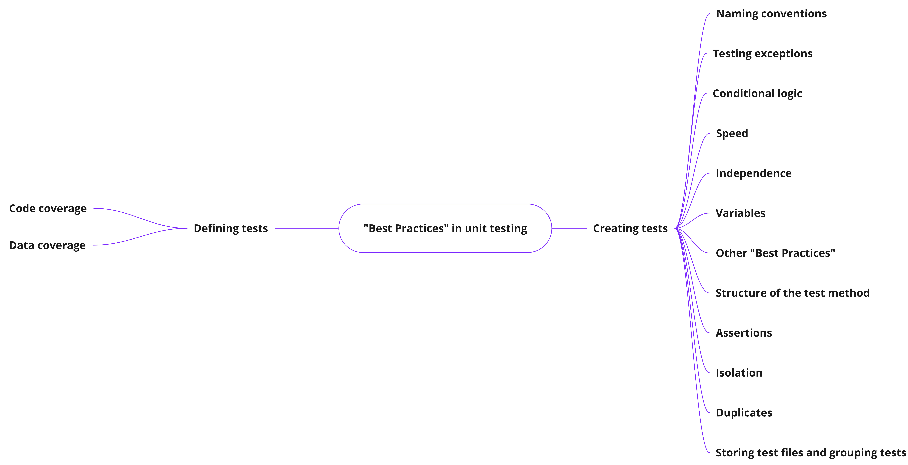
img.1 Mind map capturing the breakdown of "Best Practices" into groups and subgroups

# Creating tests

This section contains best practices for creating unit tests. It basically answers the question "What should the tests and test code look like?". In other words what should 
the code of the tests look like to follow Best Practices be easy to maintain and understand.

## Duplicates

In programming, duplication of code is generally considered a bad practice. In this respect, unit tests are no exception and same principle should apply to them.

The Best Practices for working with duplicates are as follows:

-   Extract repetitive parts of the test code

-   Extract repetitive test methods

### Extract duplicate parts of the test code

Extract code blocks that are duplicated across multiple tests into a *helper method*, *setup method*, *fixture method* or *teardown method*. 
The methods should follow the same rule, and it should not share same code as well. [(Govindaraj 2015, chap. Making tests readable)](#978-1-78398-792-4),[(Martin 2009, chap. 9. Unit tests-Clean Tests)](#978-0-13-235088-4).

In addition to structural and literal duplicates you should also pay attention to so-called semantic duplicates, ie parts of the code that do not look the same but do the same thing [(Koskela 2013, chap. 5.1 Duplication)](#978-1-935182-57-3).

### Extract duplicate methods

Extract methods that are duplicated across several test files  into a separate file and import methods from the file [(Govindaraj 2015, chap. Making tests readable)](#978-1-78398-792-4).

## Speed

High speed is one of the basic qualities that unit tests should have. Based on the "Agile testing pyramid" unit tests are created first and they are the most numerous type of test. Therefore it is very important to make sure each unit test will be very fast and should avoid executing any actions that might prolongate its run.

The Best Practices regarding speed are as follows:

-   Using in-memory resources and mocking

-   Avoid actions that are blocking the main thread 

### Using in-memory resources and mocking

In case we are working with a database, need to call HTTP requests, execute soap operations, read data from files, etc., it is important to run such actions in memory and avoid actions that slow things down [(Acharya 2014, chap. Configuring tests)](#978-1-78398-251-6-978-1-78398-250-9). For example, you can use an in-memory database instead of a typical one. The in-memory database system does not work with actual files but it keeps everything in memory. Operations like reading or writing are much faster. Similarly, mocking can be used. The principle is exactly the same so actions which in the real system take a very long time will be much faster and due to that test itself will take less time to finish.

### Avoid actions that are blocking the main thread

This is mostly connected to cases when we are waiting for actions to finish in separate threads and therefore we are putting the main thread to sleep. This approach is not efficient because actions on side threads might take different time to finish each time. Therefore it is recommended to ensure that we will directly wait till actions on separate threads will finish and then we can continue in the main thread. By using this approach we will ensure that the main thread is going to wait the least time possible.

## Assertions

This section contains best practices regarding working with assertions, how to use them, and generally how to evaluate expected behaviour.

Best practices regarding assertions are as follows:
 
 -  At least one assertion per test

 -  Only one assertion per test

-   Do not use Guard Assertions

-   Keep the right order of the assertion method parameters

-   Use  messages describing the error

-   Create custom assertions methods

-   Keep the assertions simple

### At least one assertion per test

Each test should contain at least one assertion method. You should avoid cases when the body of a test contains no assertion method or is empty. Unit test frameworks usually report such tests as passed which leads to false results.

### Only one assertion per test

Opinions on this best practice are not uniform and a lot of authors have different opinions on it. Books [(Meszaros 2007, chap. 5. Principles of Test Automation)](#978-0-13-149505-0), [(Powerhouse 2018, chap. 6. Why JUnit does not report all the failures in a single test)](#978-1-976900-84-6) and [(Acharya 2014, chap. 10.Best  Practices-Working with assertions)](#978-1-78398-251-6-978-1-78398-250-9) are quite strict about it and they always require only one assertion per test. In their mind, if a test contains multiple assertions it should be split into multiple test methods. Generally, they think that having multiple assertions in a test has an impact on readability and also makes maintenance trickier.

On the other hand authors [(Martin 2009, chap. 9. Unit Tests)](#978-0-13-235088-4), [(Khorikov 2020, chap. 3.1.5 How many assertions should the assert section hold?)](#978-1-61729-627-7), [(Langr a Swaine 2013, chap. 7. Quality Tests-One Assert per Test) ](#978-1-937785-48-2) a
[(Tarlinder 2016)](#978-0-13-429106-2), [(Turnquist a Das 2018, chap. What is the right size for a test method?)](#978-1-78728-150-9) think that the rule is way too strict and that we should think about the whole thing differently. Rather than aiming for one assertion method, we should aim for testing one behaviour per test. Testing one behaviour per test can lead to multiple different outputs and it is ok to use multiple assertions to check them. In other words, a number of assertion methods should not be caused by mixing multiple test cases together but more of an unavoidable thing to test one behaviour. In general, however, the authors hold the view that a number of assertions should not be mindlessly increased and it should be kept as low as possible.

Regarding multiple assertion methods it is also important to realize one additional problem. A lot of unit testing frameworks, for example JUnit, will fail the whole test even if just one assertion method fails. This is a big problem, because even if the test is testing just one behaviour using multiple assertion methods, the result of it is misleading and it does not provide overview of all the errors. In order to get information about all the errors assertions has to be commented out one by one and test has to be repeatedly executed. Solution is either limit number of assertion errors to one or use special assertions which allow asserting multiple things in a batch. One example is the method assertAll(), that is available for the testing framework JUnit version 5 [(García 2017, chap. Jupiter assertions)](#978-1-78712-439-4). 

### Do not use Guards Assertions

One of the most common errors in the code is sudden exception like *NullPointerException* or *IndexOutOfBoundsException*. For this reason programmers add extra check which would prevent such situations. In tests such checks are redundant because the test would fail and the error message would be part of the result report. Therefore it is recommended to avoid such redundant checks, because they add no value to the test and they make the whole test longer and harder to understand [(Koskela 2013, chap. 4.9. Overprotective tests)](#978-1-935182-57-3).

### Keep the right order of the assertion method parameters

Expected value should always be custom test data and actual value the value returned by the system under the test. It is a small mistake but can lead to big problems [(Acharya 2014, chap. 10. Best Practices-Working with assertions)](#978-1-78398-251-6-978-1-78398-250-9).

### Use  messages describing the error

If it is possible it is recommended to add some additional messages exaplaining the error to the assertion methods. The message will then make it easier to understand what is the error about [(Hamill 2004, chap. 4. Writing Unit Tests-Types of Asserts)](#978-0-596-00689-1).

### Create custom assertions methods

In specific cases it is recommended to create a custom assertion methods. This approach helps readibility of the tests and prevents code duplications[(Hamill 2004, kap. 4. Writing Unit Tests-Defining Custom Asserts)](#978-0-596-00689-1). It is recommended to use this approach if there is same sequence of assertions across multiple tests. Such sequence can be then extracted into a separate class or method [(Govindaraj 2015, kap. 6. Maintaining Your Test Suite-Writing tests closer to the domain)](#978-1-78398-792-4).

### Keep the assertions simple

It is recommended to avoid overly complicated assertion methods, that do not imply what is asserted. It is very hard to understand such methods and they are also very unstable and even simple change can lead to a failure. Book [(Koskela 2013, chap. 4.2 Hyperassertions) ](#978-1-935182-57-3) calls such assertions Hyperassertions and 
gives an example of an assertions that compares content of a file with content of a file produced filed after transformation (img. 2).

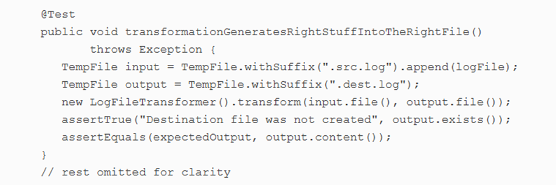

img. 2 Example of Hyperassertion [(Koskela 2013)](#978-1-935182-57-3)

## Structure of the test method

This subsection contains best practices regarding structure of the test.

Best practices regarding structure of the test method are as follows:

-   3-phase test design

-   4-phase test design

-   Do not repeat the test phases

-   Separate the test phases

### 3-phase test design

It is a simple, but very effective way of structuring test code into three parts. The first part includes creating necessary objects and setting necesarry properties which are required for the test. The second part is about executing action which should invoke tested functionality. The third part then checks expected behaviour. There are many names for this kind of approach for example **Given-When–Then** [(Khorikov 2020, chap. 3. The anatomy of a unit test)](#978-1-61729-627-7), **Build–Operate–Check** [(Tarlinder 2016, chap. 7. Unit Testing-Structuring Tests)](#978-0-13-429106-2) or **Arrange–Act–Assert (AAA)** [(Brader et al. 2012, chap. 2. Unit Testing: Testing the Inside)](#978-1-62114-018-4), but the principle is exactly the same. The first part is usually the longest one and if it is significantly longer than other two parts, it is recommended to extract it into a separate helper method or class  [(Khorikov 2020, chap. 3.1.4. How large should each section be?)](#978-1-61729-627-7). Same approach is recommended for other two parts.

### 4-phase test design

It is basically the 3-phase test design but it has extra 4th phase which is responsible for cleaning the testing environment. The phases are known by names
**Setup-Execute-Verify-Teardown** [(Tarlinder 2016, chap. 7. Unit Testing-Structuring Tests)](#978-0-13-429106-2). This approach is recommended in case when we are sharing certain objects between multiple tests or if we are creating some artifacts (for example files, directories), or if we are updating some data in a database. Without the 4th phase there we would make tests dependent on each other or influence next run of same tests. If used testing framework supports so called hook operations, it is possible to clean the testing environment by operation which is executed after each test or after all tests. Example of these hook operations is available for testing framework JUnit version 5 and are called AfterEach(after each test) or AfterAll(after all tests).

### Do not repeat the test phases

Regardless of if we decide to use 3-phase test design or 4-phase test design, each test should always contains each phase just once. Breaking this rule makes tests way to complicated and hard to understand [(Khorikov 2020, chap. 3.1.2 Avoid multiple arrange, act, and assert sections)](#978-1-61729-627-7).

### Separate the test phases

In order to make test easier to read it is recommended to separate each phase. For small tests the separation can be done by empty line. For big tests it is better to use comments [(Khorikov 2020, chap. 3.1.8 Dropping the arrange, act, and assert comments from tests)](#978-1-61729-627-7).
Img.3 shows what the separation by empty line looks like.

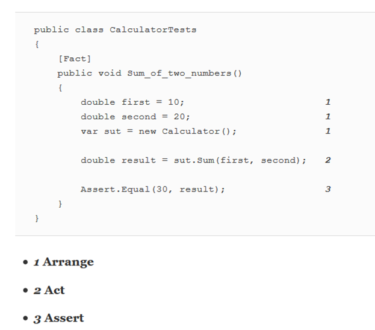

img. 3 Separation of the tests parts by empty line [(Khorikov 2020)](#978-1-61729-627-7)

## Variables

This section describes best practices regarding working with variables.

Best practices regarding variables are as follows:

-   Replace fixed values with constants

-   Do not use magic numbers

### Replace fixed values with constants

Instead of using fixed or direct values it is recommended to use constants. 

Namísto pevných, nebo přímých hodnot, je doporučováno používat konstanty. This contributes to better readability, easier understanding and it also prevents duplications that would be repeated between tests  (see img. 4)

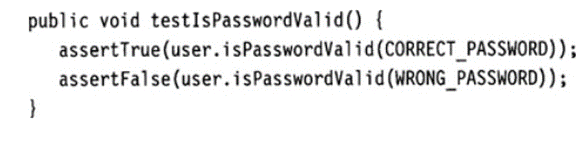

img. 4 Example of using constants instead of fixed values [(Link a Fröhlich 2003, chap. 4. Test Ideas and Heuristics)](#978-0-08-052017-9-978-1-55860-868-9)

### Do not use magic numbers

Instead of using the so-called magic numbers, ie specific values, it is better to replace numbers with constants
or variables. Appropriately named constant or variable gives the number a meaning and ensures easier readability of the code. Another way is to use an auxiliary method, which we pass as a parameter number and the method by its name gives the number meaning. This approach is advantageous if the values of the numbers for each test change (see img.5). 

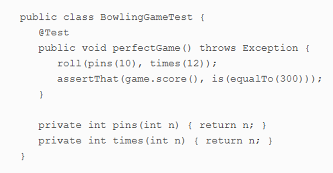

img. 5 Example of using an auxiliary method instead of magic numbers [(Koskela 2013, chap. 4.7 Magic Numbers)](#978-1-935182-57-3)

## Other "Best practices" 

Other best practices in group creating tests are as follows:

-   Keep the tests reliable

-   Delete dead code

-   Separate data generating from its asserting

###  Keep the tests reliable

Tests should be consistent and should behave exactly same every time you run them. Tests that have from time to time different result are bad and are called "*Erratic tests*" [(Koskela 2013, kap. 2.4 Independent tests run easily in solitude)](#978-1-935182-57-3).

### Delete dead code

Dead code is a redundant part that just makes test files bigger and confuses other programmers. Example of dead code is commented out test methods [(Koskela 2013, chap. 6.1 Commented-out tests)](#978-1-935182-57-3). It is recommended to analyze why was a certain test commented out and if there was no particular reason it should be deleted.
není, tak test vymazat.

### Separate data generating from its asserting

If there are a lot of testing data then its generating should be separated from its asserting. Testing method should accept just parameters and data itself should be generated separately [(Brader et al. 2012, chap. Separate test data generation from verification)](#978-1-62114-018-4). Each combination of parameters is then one test case. An example of this are parameterized tests in JUnit version 5(see img.6)

img.6 Example of separating data generation from asserting
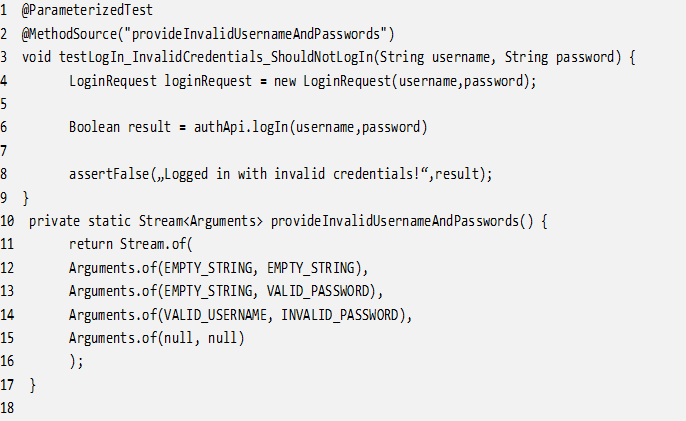

## Testing exceptions

This subsection contains best practices regarding testing exception which are thrown by system under test. It covers cases when we are testing that certain exception was thrown and also cases when exceptions are just part of the test code.

Best practices regarding testing exceptions are as follows:

-   Catch tested exceptions using framework or library tools

-   Set general level for the test exception

### Catch tested exceptions using framework or library tools

It is not recommended to test exceptions by using *try* and *catch* block. Using the blocks only is redundant and it make test method bigger and makes it harder to read and understand test [(Link a Fröhlich 2003, chap. 4. Test Ideas and Heuristics)](#978-0-08-052017-9-978-1-55860-868-9). Also as stated by [(Koskela 2013, chap. 6.3 Never-Failing Tests)](#978-1-935182-57-3), this approach can lead to so-called *Never failing tests* which happends in case when we fortget to fail test in case when exception has not been thrown. 

Instead it is recommended to use methods or tools provided by testing frameworks and testing libraries. For example annotation @expectException for testing framework JUnit version 4 or ExpectedException for testing framework
*Visual Studio Test System.* By using this method we ensure that test is easier to read and understand and we also ensure that the test will behave correctly in all occasions.

### Set general level for the test exception

In cases where throwing an exception is not part of the test but is a possible product of one of the executed methods, we should again not use *try catch* blocks, but the exception should be caught by the test method itself. The reason is again improving the readability of the test code by reducing its length and also ensuring correct behaviour in case of exception thrown. The exception will thus be caught
by the test framework itself and the test will fail.

In this respect, it is also very important to pay attention to the level of exception that the test method will catch. It should always be the level of the exception at the top of the hierarchy, for example for the c++ programming language it is the *exception* class. This approach ensures easier maintainability of the tests, because if the production code is modified and a certain method starts throwing a different type of exception, the tests will not need to be changed as the top level will catch this case [(Acharya 2014, chap. 10. Best Practices-Handling exceptions)](#978-1-78398-251-6-978-1-78398-250-9)

## Conditional logic

This subsection addresses the issue of using conditional logic inside test code.

Nejlepší postupy týkající se podmíněné logiky jsou následující:

-   Do not use if,switch, for or while blocks in a test

### Do not use if, switch, for or while blocks in a test

Conditional logic in the form of if, else, for, or while should not be part of part of the test code. It generally increases the complexity of the test method, making it difficult to read and makes it very difficult to determine what is actually being tested. It leads to skipping some verification methods and gives the illusion of correctness [(Koskela 2013, chap. 4.5 Split personality)](#978-1-935182-57-3). A general solution to this problem is to extract all conditional
branches into separate tests. Another possibility is to use the so-called *Parameterized tests,* each option is represented by a single set of parameters.*

## Naming conventions

This subsection contains best practices for naming test methods, test classes, and general naming recommendations. Proper naming is extremely important as it helps the readability and clarity of the tests. In the long run, it also helps make tests easier to maintain, as the name gives us a clear indication of what the test actually tests.

Best practices regarding naming conventions are as follows:

-   Setup a test naming strategy

-   Maintain consistent test naming

-   Use one naming strategy for the concept

-   Use "known solution" names

-   Use appropriate names for test classes

-   Use pronounceable and searchable names

-   Prevent misinformation

-   Use sufficiently distinct names

-   Omit redundant name parts

-   Use intent revealing names

### Setup a test naming strategy

There are several recommended strategies that can be used for naming tests.
For example, [(Langr et al. 2015, Ch. 4. Organizing Your Tests-Tests as Documentation)](#978-1-937785-48-2) recommends following ways:

- *doingSomeOperationGeneratesSomeResult*

- *someResultOccursUnderSomeCondition*

- *given-when-then*

- *givenSomeContextWhenDoingSomeBehaviorThenSomeResultOccurs*

Other literature [(Tarlinder 2016, Ch. 7. Unit Testing)](#978-0-13-429106-2), [(Khorikov 2020, Ch. 3. The anatomy of a unit test)](#978-1-61729-627-7) suggests splitting the title into 3 parts *whatIsTested_contitions_expectedResult.*

The above mentioned methods are also referred to as Behavior-driven Development Style, i.e. the test name expresses the expected behavior of the system under test. However, it is worth mentioning that the chosen naming strategy is subjective, but regardless of which naming strategy we choose name should always contain 3 informations:

1. what is being tested

2. what are the conditions, the data for the test

3. what is the expected outcome of the test

In some cases, the above procedure can lead to very long test names that are difficult to read. In this case, it is worth adding a long description to the test name. For example in Python, this can be achieved with docstring [(Govindaraj 2015, ch. 7. Executable Documentation with doctest)](#978-1-78398-792-4). For Java and the JUnit version 5 testing framework, there is a displayName annotation

### Maintain consistent test naming

Whichever test naming strategy you choose, you must stick to it and name all tests in a consistent way. If each test is named in a different, albeit correct, way, it will be much more difficult for its reader to understand what is being tested and the tests as a whole [(Tarlinder 2016, Ch. 7. Unit Testing)](#978-0-13-429106-2).

### Use one naming strategy for the concept

It is generally recommended to use only one naming style for a concept. It is very confusing to use the prefix "create" for a helper method that creates an object in one test and use the prefix "build" for a helper method that does exacltly same thing. This will then make a person reading a method wonder if the method with the "create" prefix is any different from the method with the "build" prefix. They will then have to explore a method and spend will more time with writing tests [(Martin 2009, ch. 2. Meaningful Names)](#978-0-13-235088-4).

### Use "known solution" names

This recommendation is closely linked to the previous one. For concepts that are generally known and are formed in the same way we should use common names [(Martin 2009, ch. 2. Meaningful Names)](#978-0-13-235088-4). An example of this is if we use the Builder design pattern. Instead of the standard naming style "NameObjectBuilder", we would end it with the suffix creator, or other equivalent. Again, this is a confusing name that requires to navigate through the implementation and makes it difficult to create or read tests.

### Use appropriate names for test classes

It is recommended to end the name of the test class with the suffix "Test". This way clearly indicates which classes are test classes and also plays a role in many cases for the tools that run the tests.

### Use pronounceable and searchable names

Whether it is a method, class, or variable, in general names that are easy to pronounce and find should be used [(Martin 2009, ch. 2. Meaningful Names)](#978-0-13-235088-4). It makes it easier for people working with tests to communicate because name are easier to memorize and search.

### Prevent misinformation

The name of the method or variable should not be confusing and should express what is it actually represents [(Martin 2009, ch. 2. Meaningful Names)](#978-0-13-235088-4). An example would be a variable named *activationDate*, which is actually of type long and represents a date in milliseconds. In this case, the name is misleading and a more appropriate name would be variable *activationDateMilis*

### Use sufficiently distinct names

We should always use different names for different concepts. Examples are two parameters representing the source and target, named *a1* and *a2*. Such naming is completely inappropriate because they can very easily be confused. If the names were *source* and *destination,* it would be much more difficult to confused them [(Martin 2009, ch. 2. Meaningful Names)](#978-0-13-235088-4).

Information noise in names is also related to this issue. For example, if we create two classes *ProductInfo* and *ProductData*. *Data* and *Info* means actually the same thing, but they are two separate classes [(Martin 2009, ch. 2. Meaningful Names)](#978-0-13-235088-4).

###  Omit redundant name parts

Names should not include redundant information that does not add any value and only lengthens the name. Those are information that are quite obvious from the context of use and thus need not be included [(Martin 2009, ch. 2. Meaningful Names)](#978-0-13-235088-4). An example are words like *variable*, *constant* or *property* in variable name or words *method or function* in method names or *class* in name of a class.

### Use intent revealing names

This best practice is closely related to the aforementioned rules of *Use pronounceable and searchable* names, *Avoid misinformation*, and states that method or variable names should always communicate intent and make it clear for which purpose they were created [(Martin 2009, Ch. 2. Meaningful Names)](#978-0-13-235088-4).  An example might be when we create a variable representing yesterday's date. A bad name would be if we named it, for example, "date". Conversely, a name that communicates the intent would be "yesterday".

## Storing test files and grouping tests

Tato podsekce obsahuje nejlepší postupy týkající se uložení testů a testovacích
souborů ve vývojovém prostředí.

Nejlepší postupy týkající se uložení testovacích souborů a seskupování testů jsou
následující:

-   Keep tests outside of production code

-   Store tests for one system under test in one place

### Keep tests outside of production code

Unit tests should always be placed outside of production code. One of the common
problem is to store tests in the same class as the code under test, but this leads to
a number of problems:

- The class becomes very long and unreadable over time.

- Tests require importing additional dependencies, and that affects
    the size of the final package when building the application

- Execution of tests is more challenging

Similarly, saving tests in a separate file that is in the same package as the code under test leads to problems:

- Package clutter, difficult to find files

- Inflating the size of the resulting package when building the application

It is recommended to store tests in a separate folder hierarchy that is completely
separate from the production code. [(Govindaraj 2015, Ch. 6. Maintaining Your Test Suite-Organizing tests)](#978-1-78398-792-4) lists two popular ways
storing tests. The first is to store the tests in a separate package that is
part of the main code package (see img. 7).

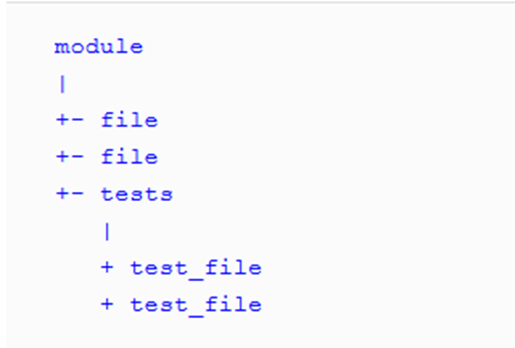

img. 7 Example of saving tests as a sub package of production code [(Govindaraj 2015, Ch. 6. Maintaining Your Test Suite-Organizing tests)](#978-1-78398-792-4)

The second way is shown in img. 8, and in this case the tests are stored in
separate package, outside of the production code package.

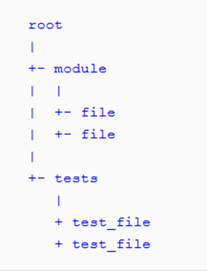

img. 8 Saving tests in a separate package outside the production code package
[(Govindaraj 2015, Ch. 6. Maintaining Your Test Suite-Organizing tests)](#978-1-78398-792-4)

In addition to these two methods, however, there is a third method that is specific to
certain systems, such as Java. The latter places tests and production code in
the same package, but in different physical locations, i.e. it sets them to different
root folder (see img. 9).

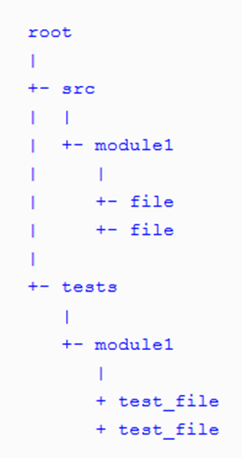

img. 9 Saving tests and code into the same packages with different root folder
[(Govindaraj 2015, Ch. 6. Maintaining Your Test Suite-Organizing tests)](#978-1-78398-792-4)

### Store tests for one system under test in one place

It is generally recommended to store all tests related to a particular system under test in one place. However, the book [(Link and Fröhlich 2003, Ch. 4. Test Ideas and Heuristics) ](#978-0-08-052017-9-978-1-55860-868-9) presents cases where
it is appropriate to violate this rule:

- The number of tests in the test suite is too large and the class becomes very
    cluttered, we should separate tests with the same characteristics into
    separate test files. The huge number of tests may also indicate a violation of the principle of one responsibility in the system under test, and thus is is a good idea to consider splitting the system under test into multiple parts.

- Preliminary steps, e.g. in the setUp method, are repeated for many tests and for others
    do not. These tests should be separated into a separate test class.

## Nezávislost

Tato podsekce obsahuje nejlepší postupy pro zajištění nezávislosti testů.
Nezávislost testů je jednou ze základních vlastností jednotkového testu.
Vyjadřuje to, že by testy neměly záviset jeden na druhém. Jeden test by neměl
nastavovat podmínky pro následující test a každý test by měl být schopen běžet
nezávisle a v jakémkoliv pořadí [(Martin 2009)](#978-0-13-235088-4). Mimo rozsah této definice pokrývá
podsekce také širší aspekt nezávislosti testů z hlediska nezávislosti na
prostředí či produkčním kódu

Nejlepší postupy týkající se nezávislosti jsou následující:

-   Nepoužívat globální statické proměnné

-   Nepoužívat znalost domény

-   Používat relativní cesty

-   Nezávislost na platformě

-   Nezávislost na produkčním kódu

-   Tvořit vlastní data a zdroje

<h3 id="nepouzivat-globalni-staticke-promenne">Nepoužívat globální statické proměnné</h3>

Napříč jednotlivými testy bychom neměly používat a upravovat globální statické
proměnné. Testy sdílejí referenci na stejnou proměnnou a pokud ji některý
upraví, změní to podmínky pro test následující [(Acharya 2014, kap. 10. Best Practices-Configuring tests)](#978-1-78398-251-6-978-1-78398-250-9). Pokud je proměnná tzv. Neměnná (Immutable), tedy není možné měnit její vnitřní nastavené hodnoty, je řešením udělat proměnnou konstantou. Poté už nemohou jednotlivé testy měnit její referenci a ani její obsah (příkladem je klíčové slovo final v jazyku Java).
Pokud lze pro proměnnou měnit její vnitřní hodnoty je doporučeno převést ji na úrovni testovací třídy a nastavit ji buď v testu samotném nebo pomocí tzv. hook metody, která je spouštěna před každým testem.  Pří použití hook metody je nutné proměnnou znovu
inicializovat.

### Nepoužívat znalost domény

Jedná se o případ, kdy používáme doménu, na níž testy vytváříme, pro stanovení
výsledku testu. Jednoduchým příkladem je třída, jež má metodu pro sčítání dvou
čísel. Špatným způsobem, jak metodu testovat je sečíst vstupní parametry v testu
a poté je očekávat jako výsledek (viz. obr. 10). Správně bychom však měly
výsledek vypočítat sami a rovnou jej dosazovat jako očekávaný výsledek (obr.
11).

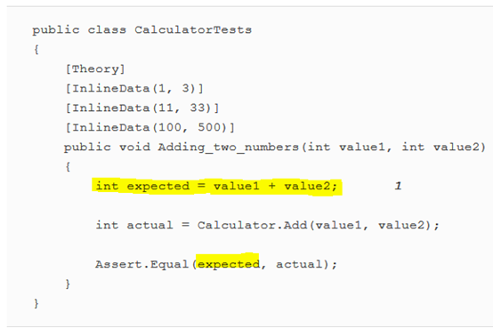

obr. 10 Ukázka porušení pravidla a používání znalosti domény [(Khorikov 2020, kap. 11. Unit testing anti-patterns)](#978-1-61729-627-7)

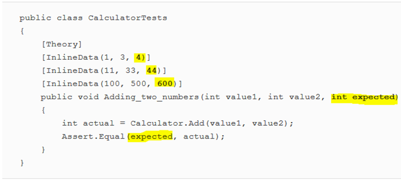

obr. 11 Ukázka správného testu, kde není použita znalost domény [(Khorikov 2020, kap. 11. Unit testing anti-patterns)](#978-1-61729-627-7)

###  Používat relativní cesty

Součástí testů by nikdy neměli být absolutní cesty k používaným zdrojům. Zdroje
bychom měly ukládat na společné místo sdíleného projektu a odkazovat na ně
relativními cestami [(Koskela 2013, kap. 5.4 Clippling File Path)](#978-1-935182-57-3).

### Nezávislost na platformě

Často se v testu vyskytuje podmíněná logika, která rozlišuje, co a jak se bude
testovat v závislosti na použité platformě. Příklad špatného testu, který je
závislý na platformě, je ukázán na obr. 12. Jak je možné vidět, tak podle
operačního systému se mění ověřovací metody testu.

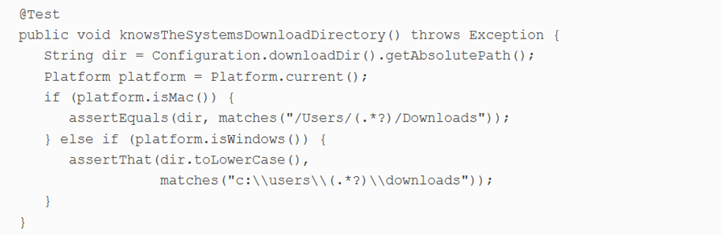

obr. 12 Příklad testu závislého na platformě [(Koskela 2013, kap. 6.6 Platform prejudice)](#978-1-935182-57-3)

Namísto tohoto postupu je doporučováno jednak test rozdělit na samostatné testy
a jednak zajištění prostředků pro spouštění testu nezávisle na platformě.
Příkladem je vytvoření vlastní třídy, jež bude představovat operační systém a na
ní poté pouštět test (viz obr. 13).

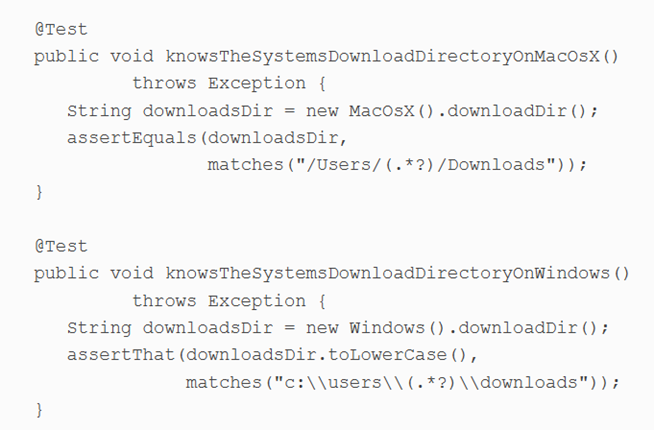

obr. 13 Příklad testu nezávislého na operačním systému [(Koskela 2013, kap. 6.6 Platform prejudice)](#978-1-935182-57-3)

### Dodržovat nezávislost na produkčním kódu

Testovací kód by v žádném případě neměl být součástí produkčního kódu. Stejně
tak by neměl produkční kód obsahovat metodu co je volaná jenom v rámci testů. 
Pokud se systém chová jinak pokud je testován, jak si můžeme být jistí, že opravdu funguje. Správný systém by měl umožnit izolování každé jeho části a umožnit její otestování
[(Meszaros 2007, kap. 5. Principles of Test Automation)](#978-0-13-149505-0), [(Bowes et al. 2017)](#978-1-5386-2807-2).

### Tvořit vlastní data a zdroje

Zdroje a data bychom měli vytvářet pro testy separátně a odděleně od testovaného
kódu [(Meszaros 2007)](#978-0-13-149505-0). Příkladem mohou být konstanty jež jsou součástí testovaného kódu a
rozhodují o chování systému. Pokud v testech potřebujeme s touto konstantou
pracovat a na jejím základě například ověřovat správné chování systému, je nutné
ji zde vytvořit znovu.

## Izolovanost

Tato podsekce obsahuje nejlepší postupy pro zajištění izolovanosti testovaného
systému a zajištění vhodných podmínek pro jeho testování.

Nejlepší postupy týkající se izolovanosti jsou následující:

-   Používat správného testovacího dvojníka

-   Nepoužívat testovací dvojníky na testovaný systém

-   Nepoužívat návrhový vzor Singleton

### Používat správného testovacího dvojníka

Používání dvojníků (v originále test double) má své bezesporné výhody. Umožňuje
nám to vytvořit ideální podmínky pro otestování dané třídy, či objektu. Můžeme
díky nim simulovat určité chování, testy zrychlit, získat přístup ke skrytým
informacím, z nedeterministického chování udělat deterministické atd. Tvorba
dvojníků nám umožňuje izolovat testovaný systém, snížit rozsah pouze na jedno
chování, které právě chceme testovat.

Jak ukazuje obr. 14, tak existují celkem 4 typy testovacích dvojníků. Použití
každého z nich se hodí v závislosti na daném kontextu a obecně nelze říct, který
by byl nejlepší. [(Koskela 2013)](#978-1-935182-57-3) specifikuje základní doporučení, kdy jednotlivé
typy používat (viz. Tabulka 1).

Tabulka 1 Popis a použití testovacích dvojníků (autor podle  [(Koskela 2013, kap. 3. Test doubles)](#978-1-935182-57-3), [(Acharya 2014, kap. 3. Test doubles)](#978-1-78398-251-6-978-1-78398-250-9))

| Název | Popis                                                                                                                 | Kdy použít                                                                                                                                                                                                       |
|-------|-----------------------------------------------------------------------------------------------------------------------|------------------------------------------------------------------------------------------------------------------------------------------------------------------------------------------------------------------|
| Mock  | Speciální případ Spy objektu. Je nakonfigurován tak, aby se choval specificky za specifických podmínek.               | V případě, kdy dochází k interakci mezi objekty v podobě volání metod.                                                                                                                                           |
| Spy   | Skrze své aplikační rozhraní odhaluje, co se v testovaném systému stalo a snáze tak otestovat chování                 | Použití mock objektu způsobuje zhoršení čitelnosti a srozumitelnost testovacího kódu.                                                                                                                            |
| Stub  | Slouží k zamezení provádění funkcionality, která nás pro účely testu nezajímá nebo ještě nebyla naprogramována        | Máme zájem na přítomnosti spolupracujících objektů nebo dodávání dat testovaným systémům.                                                                                                                        |
| Fake  | Simuluje chování testovaného sytému, ale bez vedlejších efektů a dalších dopadů, které by jeho použití mohlo způsobit | chceme pouštět komplexní scénář, který závisí na službě, nebo komponentě jež je nedostupná nebo nemožná k použití pro účely testu a mockování všech interakcí by vedlo k velmi komplexnímu a nepřehlednému kódu. |

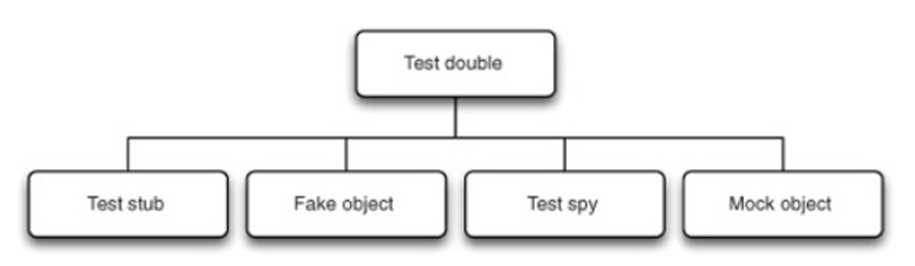

obr. 14 Typy testovacích dvojníků [(Koskela 2013, kap. 3. Test doubles)](#978-1-935182-57-3)

### Nepoužívat testovací dvojníky na testovaný systém

Nijak bychom neměli modifikovat či měnit systém, který testujeme. Zasahujeme tím a modifikujeme jeho reálné chování. Tento princip je znázorněn na obr. 15 [(Koskela 2013, kap. 3. Test doubles)](#978-1-935182-57-3), testovaný kód by vždy měl být reálný a pouze další jednotky či systémy, se kterými spolupracuje mohou být reprezentovány dvojníky.
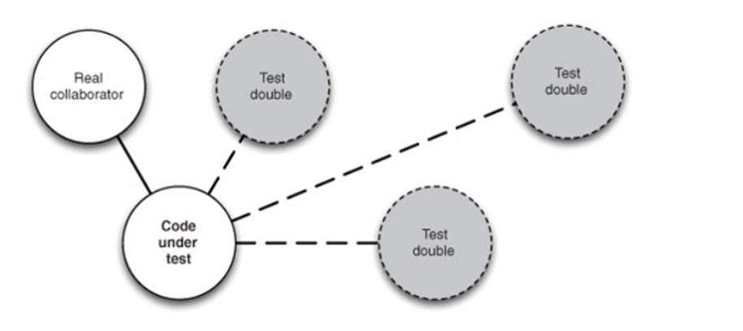
obr.15 Diagram použití dvojníků na testovaný systém [(Koskela 2013, kap. 3. Test doubles)](#978-1-935182-57-3)
### Nepoužívat návrhový vzor Singleton

Singletony představují pro testování velký problém. Jedná se o poměrné dobrý
návrhový vzor, když ale přijde na testování, tak přináší komplikace. Problém je
že se jedná v podstatě o globální proměnou, na kterou máme pouze právo čtení a
nemůžeme ovlivňovat její vnitřní stav, či ji inicializovat. Pro testování to
představuje dva problémy:

-   Musíme se ujistit, že umístíme požadované singletony do správného stavu na
    začátku testu a nahradíme originál

-   Každá test může vyžadovat trochu jinou konfiguraci, což může vést k velkému
    množství kódu

Řešením je vyhnout se používání singletonů. Princip singleton objektů je jejich
exkluzivita ve specifickém kontextu. Tento kontext může být systém, uživatel
nebo session. Místo tvorby signeltonu můžeme využít tohoto pricipu a použít
systémový, uživatelský nebo session objekt k tomu, aby nám dal přístup k
objektů, které by jinak byli sigletony [(Link a Fröhlich 2003, kap. 6.9 Evil Singletons). ](#978-0-08-052017-9-978-1-55860-868-9).

# Vymezení testů

Tato podkapitola obsahuje nejlepší postupy týkající vymezování jednotkových
test. Pomyslně odpovídá na otázku „Co by mělo být testováno?“, tedy jaké by měly
být jednotlivé testovací případy a podle čeho bychom je měli vymezovat.
Podkapitola je dále rozpadnuta do několika podsekcí, které vymezují nejlepší
postupy týkající se určitého aspektu vymezení testovacích případů.

## Pokrytí kódu (Code coverage)

Tato podsekce obsahuje nejlepší postupy pro zajištění správného pokrytí kódu
jednotkovými testy. Je zde vymezeno, které části a oblasti je nezbytné testovat
a jak přemýšlet při vymezování testovacích případů.

Nejlepší postupy týkající se pokrytí kódu (Code coverage) jsou následující:

-   Neimplementovat jednoduché testy

-   Implementovat jak happy, tak sad testy

-   Implementovat testy pro každý netriviální systém

-   Netestovat abstraktní systémy

-   Testovat pouze veřejné chování testovaného systému

-   Testovat chování, ne metody systému

-   Zachovávat princip jedné odpovědnosti testu

### Neimplementovat jednoduché testy

Obecně je doporučováno nevytvářet testy pro primitivní funkcionality testovaného
systému. Příkladem jsou get a set metody, které jsou obecně používaným principem
pro získávání hodnot parametrů a nastavování hodnot parametrů objektů [(García 2017, kap. Software testing principles)](#978-1-78712-439-4). Testování
těchto velmi jednoduchých metod je zbytečně, protože jsou prakticky imunní vůči
chybě. Pokud je však s nimi svázaná nějaká komplexnější logika, jež by mohla
vést k vedlejším účinkům, je vhodné i pro tyto metody napsat jednotkový test.

Obecně platí pravidlo, že pro každý netriviální systém bychom měli vytvářet
jednotkové testy. Základní otázkou, kterou bychom si měli klást je „Má systém
uvnitř vlastní logiku?“ [(Link a Fröhlich 2003, kap. 3. Basic Steps of the Test-First Approach)](#978-0-08-052017-9-978-1-55860-868-9).

### Implementovat jak happy, tak sad testy

Při vytváření jednotkových testů pro určitý systém, bychom měli vytvářet jak
happy testy, tedy test správného fungování testované funkcionality, tak sad
testy, tedy testy, jež se snaží rozbít systém a očekávají adekvátní reakci na
toto nesprávné použití funkcionality [(García 2017, kap. Software testing principles)](#978-1-78712-439-4). Pokud bychom neimplementovali jak happy tak sad testy, tak to může vést k falešně pozitivním či falešně negativním výsledkům jednotkových testů.

### Netestovat abstraktní systémy

Abstraktní systémy jako takové by neměli být testovány, jelikož pro jejich vytvoření je potřeba existence konkrétní instance. Jak popisuje  [(Link a Fröhlich 2003, kap. 7. Inheritance and Polymorphism)](#978-0-08-052017-9-978-1-55860-868-9), tak jednou možností je vytvoření instance abstraktního systému čistě pro účely testování. Tento přístup se však ve většině případů nevyplácí, jelikož abstraktní systém je zřídkakdy natolik komplexní, aby byl tento přístup obhajitelný.
Autoři však tento postup doporučují porušit v případě kdy je vyvíjen framework. V takovém případě je nutné otestovat abstraktní systém i pokud pro něj neexistuje žádná konkrétní instance, jelikož uživatelé frameworku konkrétní instance vytvářet budou.

<h3 id="testovat-pouze-verejne-chovani-testovaneho-systemu">Testovat pouze veřejné chování testovaného systému</h3>

Platí doporučení, že bychom vždy měli vždy testovat pouze veřejné chování
testovaného systému, které bývá vyjádřeno pomocí veřejných metod. Implementace
privátních metod či metod privátních pro balíček je velmi často měněna, metody
jsou mazány či přidávány, a to nezávisle na chování systému jako celku. Privátní
metody jsou pouze pomocným nástrojem pro zajištění veřejného chování testovaného
systému. Jejich testování vytváří velké množství závislostí mezi kódem a testy a
z dlouhodobého hlediska to vede k obtížné udržovatelnosti testů a nutnosti
jejich časté úpravy a aktualizace. [(Khorikov 2020, kap. 11. Unit testing anti-patterns)](#978-1-61729-627-7) a [(Langr et al. 2015, kap. 9. Bigger Design Issues) ](#978-1-937785-48-2) uvádí,
že pokud obsahují privátní metody komplexní chování a zdá se, že by mělo smysl
pro ně samostatný test napsat, jedná se o ukázku chyby v návrhu daného systému a
porušení principu jedné odpovědnosti (Single Responsibility Principle). Takové
chování by tedy mělo být vyextrahováno do samostatné třídy a testovaný systém by
s ní měl pouze komunikovat.

Výjimkou z tohoto principu je situace, kdy je privátní metoda součástí
pozorovaného chování systému. Například pokud máme privátní konstruktor třídy,
která je součástí ORM knihovny a její inicializace by neměla být povolena. V
takovém případě je privátnost součástí pozorovaného chování a konstruktor by měl
zůstat privátní [(Khorikov 2020, kap. 11. Unit testing anti-patterns)](#978-1-61729-627-7).

### Testovat chování, ne metody systému

Je důležité zaměřovat se na chování tříd, ne na testování individuálních metod. Při specifikaci jednotkových testů je nutné používat holistický pohled a testovat chování testovaného systému, ne jeho individuální metody [(Langr et al. 2015, kap. Testing Behavior Versus Testing Methods)](#978-1-937785-48-2).

### Zachovávat princip jedné odpovědnosti testu

Stejně jako při psaní produkčního kódu, kde je princip jedné odpovědnosti jedním
ze základních pravidel, je doporučováno toho pravidla dbát i při psaní
jednotkových testů. I pouze jedna testovaná komponenta v sobě může zahrnovat
více malých funkcionalit, nebo funkcí. Důležité je v rámci testu zohledňovat
pouze jednu tuto dílčí funkcionalitu či chování, jelikož se pak testy snáze
udržují a také se snáze odhalují problémy, pokud testy selhávají [(Meszaros 2007)](#978-0-13-149505-0).

## Datové pokrytí (Data coverage)

V rámci této podsekce jsou vymezeny nejlepší postupy týkající se volení vhodných
dat při specifikaci testovacích systému. Vhodné zvolení dat vede k zajištění
dostatečného datového pokrytí testovaného systému a neopomenutí důležitých
testovacích scénářů.

Nejlepší postupy týkající se datového pokrytí (Data coverage) jsou následující:

-   Testovat hraniční podmínky

-   Kontrolovat inverzní vztahy

-   Provádět křížovou kontrolu s pomocí jiných prostředků

-   Vynucovat chybné podmínky

-   Používat jednotkové testy pro měření výkonových charakteristik testovaného
    systému

-   Vymezovat třídy ekvivalence

-   Testovat krajní hodnoty

-   Testovat změny stavu

-   Testovat pomocí rozhodovacích tabulek

### Testovat hraniční podmínky

Mnoho chyb v kódu velmi často vzniká vlivem mezních hodnot povolené podoby dat.
Jeden obyčejný *„happy day“* scénář na takové problémy nenarazí. Je proto
doporučováno testovat hraniční podmínky vstupních dat. [(Langr et al. 2015, kap. 6. What to Test: The Right-BICEP)](#978-1-937785-48-2)
vymezuje akronym **CORRECT**, který napomáhá zapamatování si vhodného přemýšlení
o hraničních podmínkách jednotkových testů (viz Tabulka 4).

Tabulka 4 Popis dílčích částí akronymu CORRECT (autor a [(Langr et al. 2015, kap. 6. What to Test: The Right-BICEP)](#978-1-937785-48-2)

| Conformance-Shoda                                                                                                                                                                                                                                                                                                                                                                                                                                                                                                                                                                                                                                                                                                                                                                                                                                                                                                                                                                                                                                                                                                                                                                                        |
|----------------------------------------------------------------------------------------------------------------------------------------------------------------------------------------------------------------------------------------------------------------------------------------------------------------------------------------------------------------------------------------------------------------------------------------------------------------------------------------------------------------------------------------------------------------------------------------------------------------------------------------------------------------------------------------------------------------------------------------------------------------------------------------------------------------------------------------------------------------------------------------------------------------------------------------------------------------------------------------------------------------------------------------------------------------------------------------------------------------------------------------------------------------------------------------------------------|
| Data velmi často musejí splňovat nějaký formát, aby byla validní. Může se tak například jednat o emailovou adresu, uživatelské jméno, název souboru, telefonní číslo apod. Pokud je struktura dat velmi komplexní může to vést k extrémnímu počtu kombinací k otestování (S velkým množstvím kombinací může velmi napomoct využití parametrizovaných testů, jako například nabízí JUnit5. Zde je možné velmi jednoduše vytvořit stovky testovacích napsáním pár řádků kódu). Stejná data mohou být v našem systému používána mnoha funkcionalitami. Není však potřeba testovat jejich správný formát úplně všude, ale zaměřit se pouze na míst kdy data do systému vstupují, zde provést kontrolu a další kontrola již není potřeba (Stejně tak je potřeba data kontrolovat na výstupu funkcí jež je nějakým způsobem mění či upravují).                                                                                                                                                                                                                                                                                                  |
| **Order-Pořadí**                                                                                                                                                                                                                                                                                                                                                                                                                                                                                                                                                                                                                                                                                                                                                                                                                                                                                                                                                                                                                                                                                                                                                                                         |
| Správné pořadí dat v kolekci je jedním z předpokladů, který může být v kódu snadno porušen. Pokud tedy testujeme nějakou kolekci, kde je důležité pořadí, je vhodné vytvořit testy jež pořadí testují.                                                                                                                                                                                                                                                                                                                                                                                                                                                                                                                                                                                                                                                                                                                                                                                                                                                                                                                                                                                                   |
| **Range-Rozsah**                                                                                                                                                                                                                                                                                                                                                                                                                                                                                                                                                                                                                                                                                                                                                                                                                                                                                                                                                                                                                                                                                                                                                                                         |
| Je důležité se zaměřit na povolený rozsah hodnot proměnné. V řadě případů je velmi nevhodné používat primitivní datové typy pro hodnoty s omezeným rozsahem, jelikož pak může velmi snadno nastat chyba a dostaneme se mimo povolený rozsah. Příkladem je například věk, nebo úhel. Tomuto se dá předejít vytvořením vlastního datového typu, který nepovolí překročení dovoleného rozsahu.                                                                                                                                                                                                                                                                                                                                                                                                                                                                                                                                                                                                                                                                                                                                                                                                              |
| **Reference**                                                                                                                                                                                                                                                                                                                                                                                                                                                                                                                                                                                                                                                                                                                                                                                                                                                                                                                                                                                                                                                                                                                                                                                            |
| Při testování metody je nutné zvážit na co odkazuje mimo rámec své působnosti, jaké má externí závislosti, jestli závisí na tom, zda je objekt v určitém stavu a zda musejí být splněny nějaké další podmínky. Například pro zobrazení účtu uživatele musí být uživatel přihlášen apod. Měli potom vytvářet testy tak abychom ověřili že se daná třída nebo zkrátka testovaný kus kódu chová správně i když některé podmínky nejsou splněny, protože jsme usoudili že logicky nejsou potřeba. Je ale vhodné takové stavy ověřovat a předejít tak nepředvídatelnému chování.                                                                                                                                                                                                                                                                                                                                                                                                                                                                                                                                                                                                                              |
| **Existence**                                                                                                                                                                                                                                                                                                                                                                                                                                                                                                                                                                                                                                                                                                                                                                                                                                                                                                                                                                                                                                                                                                                                                                                            |
| Je důležité klást si otázku, zda musí určitá věc vždy existovat. Obvykle mají programátoři tendenci psát pouze „happy day“ testy, je však také důležité zamyslet se nad tím jaké vstupní parametry se mohou do metody dostat. Co se stane, pokud je vstupní parametr null, soubor neexistuje apod.?                                                                                                                                                                                                                                                                                                                                                                                                                                                                                                                                                                                                                                                                                                                                                                                                                                                                                                      |
| **Cardinality – kardinalita**                                                                                                                                                                                                                                                                                                                                                                                                                                                                                                                                                                                                                                                                                                                                                                                                                                                                                                                                                                                                                                                                                                                                                                            |
| Zásada pojednává o četnosti či mohutnosti a chyby, ke kterým se často můžeme dostat. Jedná se o tzv. fencepost errors nebo také off-by-one error, což je typ chyby kdy se můžeme splést v důsledku fatální podmínky, které podlehneme. Při psaní testů bychom se měli zamyslet nad tím, jak se v našem kódu počítá, jaký výskyt určité věci můžeme mít, a jaký to má vliv. Výskyt lze zobecnit na 3 případy: Nula – nemáme nic, tedy speciální případ předchozího pravidla **Existence** Jedna – pouze jeden výskyt Mnoho – více jak jedna V angličtině se toto pravidlo nazývá jako **0-1-n** pravidlo, nebo také **ZOM (Zero,One,Many).** Je zde uveden příklad se seznamem top 10 jídel nějaké restaurace. Pokaždé co je vzata nějaká objednávka měl by se list v reálném čase updatovat. Pravidlo kardinality je v tomto případě aplikováno na specifikaci vhodných testovacích případů: Tvorba reportu, pokud v seznamu není žádné jídlo Tvorba reportu, pokud v seznamu je pouze jedno jídlo Tvorba reportu, pokud v seznamu není ještě 10 jídel  Atd…                                                                                                                                             |
| **Time - čas**                                                                                                                                                                                                                                                                                                                                                                                                                                                                                                                                                                                                                                                                                                                                                                                                                                                                                                                                                                                                                                                                                                                                                                                           |
| V souvislosti s pravidlem času je nutné si uvědomit 3 věci: **Relativní čas** – správné pořadí volání v čase Některá rozhraní jsou závislá na stavu a očekávají že se nejprve uživatel přihlásí a poté se až může odhlásit apod. Je důležité se nad tím zamyslet a přidávat testy, které pořadí porušují a očekávají chybu apod. Podobně jaké pravidlo O - ordering, kde záleží na pořadí dat, tak stejně tak záleží i na pořadí volání metod. **Absolutní čas** – uběhnutý čas, aktuální čas V souvislosti s pořadím volání se také mohou vyskytnou čekání na dostupnost zdroje. Je nutné hledat místa v kódu, kde by se potenciálně mohlo čekat na věky. Také je vhodné na určitých místech uplynutý čas měřit, a rozhodovat, zda je čekání až moc dlouhé. Aktuální čas je také velmi důležité kontrolovat. V závislosti na aktuálním čase se mohou podmínky lišit a některé testy tak nemusí vždy fungovat. Nespoléhat se na to že knihovny, které používáme tyto problémy mají ošetřené! **Problémy s konkurencí**  Je důležité si položit otázku, co se stane, pokud bude s tímto zdrojem pracovat více vláken najednou? Je to možné, může to nastat? Je potřeba synchronizovat globální proměnné?  |

### Kontrolovat inverzní vztahy

V některých případech je možné a samozřejmě vhodné otestovat inverzní chování
dané funkcionality. Příkladem je, pokud máme implementovanou matematickou funkci
pro výpočet druhé mocniny čísla. Inverzní test by poté spočíval v tom, že bychom
spočítali kořen nějakého čísla a poté testovali že použitím funkce pro výpočet
druhé mocniny ke stejnému číslu [(Langr et al. 2015, kap. 6. What to Test: The Right-BICEP)](#978-1-937785-48-2).

### Provádět křížovou kontrolu s pomocí jiných prostředků

Jedná se o podobný přístup jako v předchozím bodě, ale používáme jiné prostředky
než vlastní. Může se jednat o nějakou externí knihovnu, nebo používání různých
kusů dat z testované třídy proto abychom zjistili, zda vše dohromady sedí [(Langr et al. 2015, kap. 6. What to Test: The Right-BICEP)](#978-1-937785-48-2).

### Vynucovat chybné podmínky

Tento princip je o simulování chybných podmínek, které mohou v reálném světe
nastat. Může se například jednat o:

-   Nedostatek paměti

-   Nedostatek místa na disku

-   Dostupnost sítě apod.

Správný jednotkový test by neměl pouze testovat logické správné cesty, ale také
zjišťovat, jak se kód chová za chybných podmínek, respektive jestli se chová tak
jak očekáváme [(Langr et al. 2015, kap. 6. What to Test: The Right-BICEP)](#978-1-937785-48-2).

### Používat jednotkové testy pro měření výkonových charakteristik testovaného systému

Není vhodné vytvářet složité výkonové testy, které poběží velmi dlouho. Budou
narušovat ostatní jednotkové testy, které splňují základní zásady jednotkového
testu a běží velmi rychlé. Samozřejmě výkonnostní testy jsou důležité a jsou
potřeba, je ale lepší je spouštět odděleně od jednotkových testů. Jednotkové
testy však v tomto ohledu mohou být nápomocné. Mohou být použity pro poskytnutí
základní informace o výkonnosti nějaké funkce a tato informace bude následně
využita pro vytvoření výkonnostních testů [(Langr et al. 2015, kap. 6. What to Test: The Right-BICEP)](#978-1-937785-48-2).

### Vymezovat třídy ekvivalence

Pokud testovaný systém přijímá hodnoty v určitém stanoveném rozsahu, bylo by
psaní pro každou hodnotu velmi neefektivní a také zbytečné. Jednou z metod, jak
tomu předejít je určení skupin testovacích hodnot, které jsou ekvivalentní
neboli stačí napsat test pro každou ekvivalentní skupinu a nepsat zbytečně testy
pro prvky, které jsou si rovny. Příkladem může být funkce pro výpočet
rizikovosti pojištěných řidičů. Rozdělení může být podle věku na mladé (18-24),
střední věk (24-60) a staré (nad 60 až 100) a každý skupina představuje jiné
riziko. Stačí pak napsat pouze 3 testy pro každou ze skupin a dále můžeme napsat
ještě dva testy pro neplatné hodnoty tedy mladší 18 let a starší 100 [(Tarlinder 2016, kap. 8. Specification-based Testing Techniques)](#978-0-13-429106-2).

### Testovat krajní hodnoty

Pokud není možné v rámci rozsahu nalézt určité skupiny ekvivalence, je místo
doporučováno specifikovat testovací případy pro krajní hodnoty povoleného
rozsahu [(Dooley 2017, kap. 16. Unit Testing)](#978-1-4842-3153-1),[(Tarlinder 2016, kap. 8. Specification-based Testing Techniques)](#978-0-13-429106-2). Princip je velmi jednoduchý, pokud máme například povolený rozsah
**0-100** včetně, vytvoříme testy pro hodnoty **-1,0,100,101**. Tímto způsobem
zajistíme dostatečné otestování jak pozitivních, tak negativních případů, bez
testování zbytečných případů.

### Testovat změny stavu

V případě že v testovaném systému dochází ke změnám stavu, je vhodné vymezovat
jednotlivé testovací případy na základě stavového diagramu. Příklad takového
diagramu je zachycen na obr. 16. Zachycení jednotlivých stavů a jejich
vzájemných přechodů nám umožňuje snadno vymezit jednotlivé testovací případy.

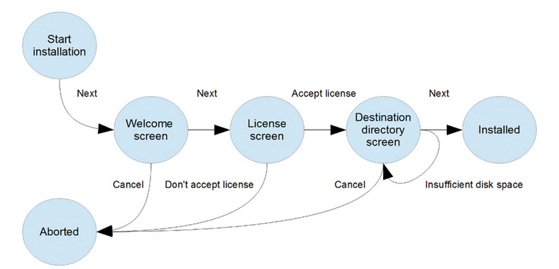

obr. 16 Ukázka stavového diagramu [(Tarlinder 2016, kap. 8. Specification-based Testing Techniques)](#978-0-13-429106-2)

### Testovat pomocí rozhodovacích tabulek

V případě, kdy je potřeba otestovat veškeré varianty a neopomenou ani jeden
případ, je doporučováno použít rozhodovací tabulku. Tento nástroj je velmi
vhodný pro tvorbu parametrizovaných testů. Řada testovacích frameworku (např.
Cucumber, JUnit5 či Spoc), poskytuje podporu pro tvorbu parametrizovaných testů
s pomocí rozhodovacích tabulek. Příklad takové rozhodovací tabulky je zobrazen
na obr. 17. Tabulka stanovuje, jaká je výše pojistného faktoru a zda bude
zahájeno vyšetřování pro podezření z podvodu, na základě věku a pohlaví klienta.

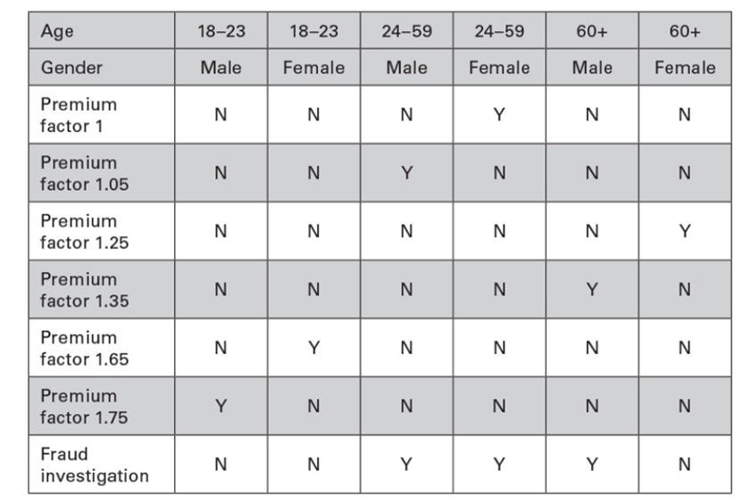

obr. 17 Rozhodovací tabulky pro určení pojistného faktoru a vyšetření podvodu
[(Tarlinder 2016, kap. 8. Specification-based Testing Techniques)](#978-0-13-429106-2)

Tabulku je poté možné použít pro vymezení jednotkových testů pro otestování
pomocné metody, jež faktor pojistného vypočítává (viz obr.18).

obr. 18 Ukázka použití rozhodovací tabulky pro specifikaci testovacích případů
(autor)

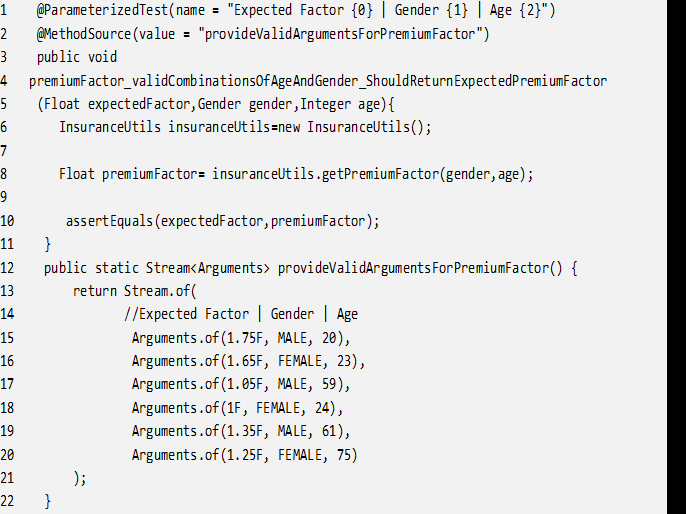

## Literatura

KOSKELA, Lasse, 2013. Effective unit testing: a guide for Java developers. Shelter Island, NY: Manning. ISBN 978-1-935182-57-3

MARTIN, Robert C., ed., 2009. Clean code: a handbook of agile software craftsmanship. Upper Saddle River, NJ: Prentice Hall. ISBN 978-0-13-235088-4.

GOVINDARAJ, Siddharta, 2015. Test-driven python development. Place of publication not identified: Packt Publishing Limited. ISBN 978-1-78398-792-4.

MARTIN, Robert C., ed., 2009. Clean code: a handbook of agile software craftsmanship. Upper Saddle River, NJ: Prentice Hall. ISBN 978-0-13-235088-4.

ACHARYA, Sujoy, 2014. Mastering unit testing using Mockito and JUnit: an advanced guide to mastering unit testing using Mockito and JUnit. Birmingham, England: Packt Publishing. ISBN 978-1-78398-251-6.

KHORIKOV, Vladimir, 2020. Unit Testing Principles, Practices, and Patterns [online] [vid. 2020-10-18]. ISBN 978-1-61729-627-7. Dostupné z: https://go.oreilly.com/university-college-london/library/view/-/9781617296277/?ar

TURNQUIST, Greg L a Bhaskar N DAS, 2018. Python testing cookbook: easy solutions to test your Python projects using test-driven development and Selenium [online]. Birmingham, England; Mumbai: Packt [vid. 2020-11-24]. ISBN 978-1-78728-150-9. Dostupné z: https://www.safaribooksonline.com/library/view//9781787122529/?ar?orpq&email=^u

MESZAROS, Gerard, 2007. xUnit test patterns: refactoring test code. Upper Saddle River, NJ: Addison-Wesley. The Addison-Wesley signature series. ISBN 978-0-13-149505-0.

LANGR, Jeff a Michael SWAINE, 2013. Modern C++ programming with test-driven development: code better, sleep better. Dallas, Texas: The Pragmatic Bookshelf. ISBN 978-1-937785-48-2.

HAMILL, Paul, 2004. Unit test frameworks. 1st ed. Sebastopol, CA: O’Reilly. ISBN 978-0-596-00689-1.

LINK, Johannes a Peter FRÖHLICH, 2003. Unit testing in Java how tests drive the code. San Francisco, Calif.: Morgan Kaufmann. ISBN 978-0-08-052017-9.

TARLINDER, Alexander, 2016. Developer testing: building quality into software. Boston: Addison-Wesley. The Addison-Wesley signature series. ISBN 978-0-13-429106-2.

GARCÍA, Boni, 2017. Mastering software testing with JUnit 5: comprehensive guide to develop high quality Java applications [online] [vid. 2021-03-27]. ISBN 978-1-78712-439-4. Dostupné z: http://proquestcombo.safaribooksonline.com/9781787285736

BOWES, David, Tracy HALL, Jean PETRIĆ, Thomas SHIPPEY a Burak TURHAN, 2017. How good are my tests? In: Proceedings of the 8th Workshop on Emerging Trends in Software Metrics. Buenos Aires, Argentina: IEEE Press, s. 9–14. WETSoM ’17. ISBN 978-1-5386-2807-2.

POWERHOUSE, Knowledge, 2018. Top 50 JUnit Unit Testing Interview Questions & Answers. B.m.: Independently published. ISBN 978-1-976900-84-6.

COHEN, Frank, 2004. Java testing and design: from unit testing to automated Web tests. Upper Saddle River, NJ: Prentice Hall PTR. ISBN 978-0-13-142189-9.

GERRITSEN, Maaike, 2010. Prime Path Coverage Exploration for Automated Unit Testing: Ensuring Accurate Code Coverage Using Aspect Oriented Programming. B.m.: LAP LAMBERT Academic Publishing. ISBN 978-3-8433-6435-5.

BRADER, Larry, Howard F HILLIKER a Alan Cameron WILLS, 2012. Testing for continuous delivery with Visual Studio 2012. ISBN 978-1-62114-018-4.

HUNT, Andrew a David THOMAS, 2000. The pragmatic programmer: from journeyman to master. Reading, Mass: Addison-Wesley. ISBN 978-0-201-61622-4.

DOOLEY, John F, 2017. Software Development, Design and Coding: With Patterns, Debugging, Unit Testing, and Refactoring, Second Edition [online] [vid. 2020-06-27]. ISBN 978-1-4842-3153-1. Dostupné z: https://ezproxy.kpu.ca:2443/login?url=http://library.books24x7.com/library.asp?^B&bookid=137913

CAMBRIDGE DICTIONARY, 2020. BEST PRACTICE | meaning in the Cambridge English Dictionary [online] [vid. 2020-08-01]. Dostupné z: https://dictionary.cambridge.org/dictionary/english/best-practice

MERRIAM-WEBSTER, 1927. Definition of BEST PRACTICE [online] [vid. 2020-08-01]. Dostupné z: https://www.merriam-webster.com/dictionary/best+practice

MANAGEMENTMANIA, 2020. Nejlepší praxe (Best Practice). ManagementMania.com [online] [vid. 2020-08-01]. Dostupné z: https://managementmania.com/cs/nejlepsi-praxe-best-practice

BOOKAUTHORITY, 2020. 21 Best Software Unit Testing Books of All Time. BookAuthority [online] [vid. 2020-10-25]. Dostupné z: https://bookauthority.org/books/best-software-unit-testing-books

BOOKAUTHORITY, 2020. About BookAuthority. BookAuthority [online] [vid. 2020-10-25]. Dostupné z: https://bookauthority.org/about

